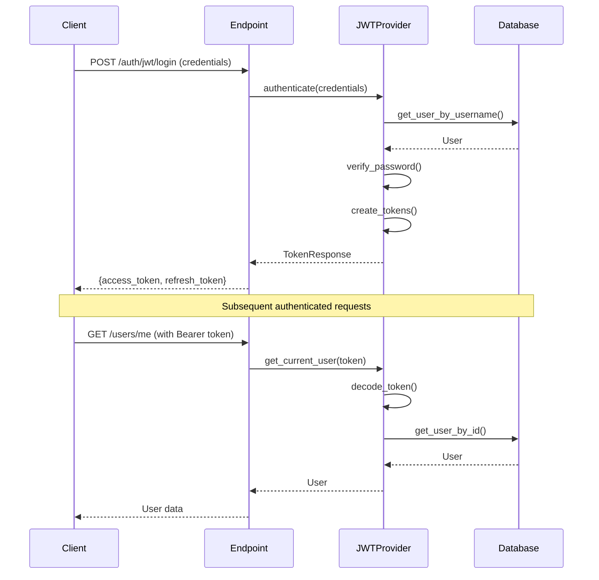

# FastAPI Backend - Developer Guide

A FastAPI backend template with authentication, database persistence, and domain-driven architecture. This template provides boilerplate code and a solid foundation that you can customize and extend for your specific needs. This guide helps you get up and running, understand the system, and build new features effectively.

## Features

### Core Infrastructure

- 🏗️ **Domain-Driven Architecture** - Self-contained business domains with layered separation (endpoints → services → repositories)
- 🗄️ **Database Management** - SQLModel ORM with Alembic migrations and generic repository pattern
- 📝 **Structured Logging** - Request tracking with correlation IDs and context-aware logging via structlog

### Authentication & Security

- 🔐 **Pluggable Auth System** - Provider abstraction with JWT implementation (easily add OAuth, API keys, etc.)
- 👥 **User Management** - Complete CRUD operations with role-based access control (RBAC)
- 🛡️ **Exception Handling** - Centralized error handling with structured responses and automatic logging

### Developer Experience

- 🐳 **Docker Integration** - Docker Compose setup with hot-reload support and devcontainer configuration
- ✅ **Comprehensive Tests** - Unit tests with pytest, fixtures, and mocking patterns
- 🔧 **Code Quality Tools** - Pre-configured ruff, mypy, and pre-commit hooks

## Getting Started

### Prerequisites

- **Python 3.12+** - Required for modern type hints and performance
- **Docker & Docker Compose** - For PostgreSQL database
- **[uv](https://github.com/astral-sh/uv)** - Fast Python package manager (recommended)

### Local Development Setup

#### 1. Install dependencies

```bash
cd backend

# Using uv (recommended - fastest)
uv sync

# Or using pip
pip install -e .
```

#### 2. Configure environment

```bash
# From project root
cp .env.example .env
```

Edit `.env` and set these critical values:

```env
# Database
POSTGRES__PASSWORD=<strong-password>

# Authentication (generate with: python -c "import secrets; print(secrets.token_urlsafe(32))")
AUTH__JWT__SECRET_KEY=<your-generated-secret>

# Admin account
SUPER_USER__PASSWORD=<admin-password>
```

#### 3. Start PostgreSQL

```bash
# From project root
docker compose up db -d
```

#### 4. Initialize database

```bash
# From backend directory
alembic upgrade head           # Run migrations
python app/db/initialize.py    # Create super user
```

#### 5. Start development server

```bash
fastapi dev app/main.py
```

### Verify Your Setup

Test these endpoints to confirm everything works:

```bash
# Health check
curl http://localhost:8000/api/v1/health

# Interactive API docs
open http://localhost:8000/api/v1/docs
```

Expected response:

```json
{"status": "healthy"}
```

## Architecture Overview

### Project Structure

```txt
app/
├── core/                    # Cross-cutting infrastructure
│   ├── auth/               # Authentication providers & dependencies
│   ├── base/               # Base models, repositories, schemas
│   ├── exceptions/         # Global exception handling system
│   ├── logging/            # Structured logging with request tracking
│   ├── pagination/         # Reusable pagination utilities
│   └── security/           # Password hashing and security utilities
├── domains/                # Business features (each is self-contained)
│   ├── users/             # User management (CRUD, roles, permissions)
│   └── health/            # Health check endpoint
├── db/                     # Database session, initialization scripts
├── config.py              # Environment-based settings (Pydantic)
├── dependencies.py        # FastAPI dependency injection
├── main.py               # Application entry point and lifespan
└── routes.py             # Central router registration

alembic/                    # Database migrations
tests/                      # Test suite (mirrors app structure)
pyproject.toml             # Dependencies & tooling configuration
```

### Design Patterns

#### Domain-Driven Design

- Each business domain (`users/`, `health/`) is isolated and self-contained
- Domains follow layered architecture: `endpoints.py` → `services.py` → `repositories.py` → `models.py`

#### Repository Pattern

- Generic `Repository[T]` base class with type-safe CRUD operations
- Domain-specific repositories extend base for custom queries

#### Dependency Injection

- Centralized in `dependencies.py`
- Database sessions, authentication, and settings injected via FastAPI dependencies

#### Provider Pattern (Authentication)

- Pluggable auth providers (`JWTAuthProvider`, easy to add OAuth, LDAP, etc.)
- No core code changes needed to add new authentication methods

### Key Architectural Concepts

#### Authentication Flow



#### Error Handling

- Custom exception hierarchy (`ApplicationError` base class)
- Automatic error handling via FastAPI exception handlers
- Structured error responses with request IDs for tracking

#### Logging Strategy

- Structured logging with `structlog` (key-value pairs, not string formatting)
- Automatic request ID generation and tracking via middleware
- Context-aware logging (request-bound loggers include user info)

## Development Workflow

### Running the Application

```bash
# Development mode (auto-reload on file changes)
fastapi dev app/main.py

# Production mode
fastapi run app/main.py

# With Docker Compose (includes database)
cd ..
docker compose up api

# With hot-reload in Docker
docker compose watch
```

### Code Quality Checks

Run these before every commit:

```bash
# From backend directory

# Format code
ruff format .

# Lint and auto-fix issues
ruff check . --fix

# Type checking
mypy .

# All at once
ruff format . && ruff check . --fix && mypy .
```

Or use pre-commit hooks:

```bash
# Install once
pre-commit install

# Run manually on all files
pre-commit run --all-files
```

### Running Tests

```bash
# All tests with coverage
pytest --cov=app --cov-report=term

# Specific test file
pytest tests/unit/domains/users/test_services.py

# Tests matching a pattern
pytest -k "test_create"

# Verbose output
pytest -v

# Stop on first failure
pytest -x

# Generate HTML coverage report
pytest --cov=app --cov-report=html
open htmlcov/index.html
```

### Database Operations

```bash
# Create new migration
alembic revision --autogenerate -m "Add user roles table"

# Apply pending migrations
alembic upgrade head

# Rollback one migration
alembic downgrade -1

# Show current database version
alembic current

# View migration history
alembic history
```

## How-To Guides

### Add a New Domain

Example: Adding a "Posts" domain

#### 1. Create domain directory structure

```bash
mkdir -p app/domains/posts
touch app/domains/posts/__init__.py
touch app/domains/posts/endpoints.py
touch app/domains/posts/schemas.py
touch app/domains/posts/services.py
touch app/domains/posts/models.py
touch app/domains/posts/repositories.py
touch app/domains/posts/exceptions.py
```

#### 2. Define database model (`models.py`)

```python
from sqlmodel import Field
from app.core.base.models import IntModel

class Post(IntModel, table=True):
    """Post domain model."""

    title: str = Field(max_length=200)
    content: str
    author_id: int = Field(foreign_key="users.id")
```

#### 3. Create Pydantic schemas (`schemas.py`)

```python
from pydantic import BaseModel, ConfigDict, Field

class PostCreate(BaseModel):
    """Schema for creating a post."""

    title: str = Field(..., max_length=200, description="Post title")
    content: str = Field(..., description="Post content")

    model_config = ConfigDict(from_attributes=True)


class PostResponse(BaseModel):
    """Schema for reading a post."""

    id: int = Field(description="Post ID")
    title: str = Field(description="Post title")
    content: str = Field(description="Post content")
    author_id: int = Field(description="Author user ID")

    model_config = ConfigDict(from_attributes=True)
```

#### 4. Build repository (`repositories.py`)

```python
from sqlmodel import select
from sqlmodel.ext.asyncio.session import AsyncSession

from app.core.base.repositories.base import BaseRepository
from app.core.base.repositories.exceptions import handle_repository_errors
from app.domains.posts.models import Post


class PostRepository(BaseRepository[Post, int]):
    """Repository for post data access."""

    def __init__(self, session: AsyncSession) -> None:
        """Initialize the repository with an asynchronous database session.

        Args:
            session: The active asynchronous session to interact with the database.
        """
        super().__init__(session, Post)

    @handle_repository_errors()
    async def find_by_author(self, author_id: int) -> list[Post]:
        """Find all posts by author.

        Args:
            author_id: The ID of the author.

        Returns:
            List of posts by the author.
        """
        statement = select(Post).where(Post.author_id == author_id)
        result = await self._session.exec(statement)
        return list(result.all())
```

#### 5. Implement service layer (`services.py`)

```python
import structlog

from app.domains.posts.models import Post
from app.domains.posts.repositories import PostRepository
from app.domains.posts.schemas import PostCreate


class PostService:
    """Business logic for posts."""

    def __init__(self, repository: PostRepository) -> None:
        """Initialize PostService with repository dependency.

        Args:
            repository: Repository for post data access operations.
        """
        self._repository: PostRepository = repository
        self.logger = structlog.get_logger("posts")

    async def create_post(self, data: PostCreate, author_id: int) -> Post:
        """Create a new post.

        Args:
            data: Post creation data.
            author_id: ID of the post author.

        Returns:
            The created post.
        """
        post = Post(**data.model_dump(), author_id=author_id)
        created_post = await self._repository.create(post)

        self.logger.info(
            "post_created",
            post_id=created_post.id,
            author_id=author_id,
            title=created_post.title,
            operation="create",
        )

        return created_post
```

#### 6. Add API endpoints (`endpoints.py`)

```python
import structlog
from fastapi import status
from fastapi.routing import APIRouter

from app.core.exceptions.schemas import (
    ErrorResponse,
    InternalServerErrorResponse,
    ValidationErrorResponse,
)
from app.dependencies import PostServiceDependency  # You'll need to create this
from app.domains.posts.schemas import PostCreate, PostResponse

router = APIRouter(prefix="/posts", tags=["posts"])

logger = structlog.get_logger("posts.endpoints")


@router.post(
    "/",
    response_model=PostResponse,
    status_code=status.HTTP_201_CREATED,
    summary="Create new post",
    description="Create a new post with provided information",
    responses={
        201: {"description": "Post created successfully"},
        422: {"model": ValidationErrorResponse, "description": "Invalid post data"},
        500: {
            "model": InternalServerErrorResponse,
            "description": "Internal server error",
        },
    },
)
async def create_post(
    post_data: PostCreate,
    post_service: PostServiceDependency,
    # Add authentication dependency here to get current user
    # current_user: Annotated[User, Security(auth_service.require_user)],
) -> PostResponse:
    """Create a new post.

    Creates a new post with the provided information. The author is set to the
    currently authenticated user.
    """
    # Replace with actual current user ID from authentication
    author_id = 1  # current_user.id

    created_post = await post_service.create_post(post_data, author_id=author_id)
    return PostResponse.model_validate(created_post)
```

#### 7. Register router (`app/routes.py`)

```python
from app.domains.posts.endpoints import router as posts_router

def setup_routes(app: FastAPI, prefix: str = "") -> None:
    # ... existing routes ...
    app.include_router(posts_router, prefix=prefix)
```

#### 8. Create and run migration

```bash
alembic revision --autogenerate -m "Add posts table"
alembic upgrade head
```

### Add an Endpoint to Existing Domain

Example: Add "deactivate user" endpoint

#### 1. Add service method (`app/domains/users/services.py`)

```python
async def deactivate_user(self, user_id: int) -> User:
    """Deactivate a user account.

    Args:
        user_id: ID of the user to deactivate.

    Returns:
        The deactivated user.

    Raises:
        UserNotFoundError: If user with given ID doesn't exist.
    """
    user = await self._repository.get_by_id(user_id)
    if not user:
        raise UserNotFoundError(
            message=f"User with ID {user_id} not found",
            user_id=user_id
        )

    user.is_active = False
    updated_user = await self._repository.update(user)

    self.logger.info(
        "user_deactivated",
        user_id=user_id,
        username=updated_user.username,
        operation="deactivate",
    )

    return updated_user
```

#### 2. Add endpoint (`app/domains/users/endpoints.py`)

```python
from fastapi import Security, status

from app.dependencies import UserServiceDependency, auth_service
from app.domains.users.models import UserRole
from app.domains.users.schemas import UserResponse


@router.post(
    "/{user_id}/deactivate",
    dependencies=[
        Security(auth_service.require_roles(UserRole.ADMIN), scopes=[UserRole.ADMIN])
    ],
    response_model=UserResponse,
    status_code=status.HTTP_200_OK,
    summary="Deactivate user",
    description="Deactivate a user account (admin only)",
    responses={
        200: {"description": "User deactivated successfully"},
        404: {"model": ErrorResponse, "description": "User not found"},
        422: {
            "model": ValidationErrorResponse,
            "description": "Invalid user ID format",
        },
        500: {
            "model": InternalServerErrorResponse,
            "description": "Internal server error",
        },
    },
)
async def deactivate_user(
    user_id: int,
    user_service: UserServiceDependency,
) -> UserResponse:
    """Deactivate a user account.

    Args:
        user_id: The unique identifier of the user to deactivate.
        user_service: Injected user service dependency.

    Returns:
        UserResponse: The deactivated user information.
    """
    user = await user_service.deactivate_user(user_id)
    return UserResponse.model_validate(user)
```

### Add a New Authentication Provider

See the detailed authentication guide: [Authentication Guide](docs/authentication.md)

Quick example: Adding API Key authentication

#### 1. Create provider (`app/core/auth/providers/apikey/provider.py`)

```python
"""API Key authentication provider implementation."""

from uuid import UUID

import structlog
from fastapi import APIRouter, Header, Request
from fastapi.security import APIKeyHeader
from fastapi.security.base import SecurityBase

from app.core.auth.exceptions import InvalidTokenError
from app.core.auth.protocols import AuthenticationUserService
from app.core.auth.providers.base import AuthProvider
from app.domains.users.exceptions import UserNotFoundError
from app.domains.users.models import User

logger = structlog.get_logger("auth.provider.apikey")


class APIKeyAuthProvider[ID: (int, UUID)](AuthProvider[ID]):
    """API Key authentication provider.

    Provides stateless authentication using API keys passed via X-API-Key header.

    Attributes:
        name: Provider identifier.
    """

    name = "apikey"

    def can_authenticate(self, request: Request) -> bool:
        """Check if request contains API key.

        Args:
            request: FastAPI request object.

        Returns:
            True if X-API-Key header is present, False otherwise.
        """
        return request.headers.get("X-API-Key") is not None

    async def authenticate(
        self, request: Request, user_service: AuthenticationUserService[ID]
    ) -> User | None:
        """Authenticate request using API key.

        Args:
            request: FastAPI request object.
            user_service: User service implementing authentication operations.

        Returns:
            Authenticated User object or None if authentication fails.

        Raises:
            InvalidTokenError: API key is invalid.
        """
        api_key = request.headers.get("X-API-Key")
        if not api_key:
            logger.warning("authentication_failed", reason="missing_api_key")
            return None

        # TODO: Implement your API key validation logic
        # Example: Look up user by API key from database
        # user = await user_service.get_by_api_key(api_key)

        logger.info("authentication_successful", api_key_prefix=api_key[:8])
        return None  # Replace with actual user lookup

    def get_security_scheme(self) -> SecurityBase:
        """Get FastAPI security scheme for OpenAPI documentation.

        Returns:
            APIKeyHeader security scheme.
        """
        return APIKeyHeader(name="X-API-Key", auto_error=False)

    def get_router(self) -> APIRouter:
        """Get FastAPI router with authentication endpoints.

        Returns:
            Empty APIRouter (API key auth typically doesn't need endpoints).
        """
        return APIRouter()
```

#### 2. Register provider with AuthService

```python
# In app/dependencies.py or your app initialization

from app.core.auth.providers.apikey.provider import APIKeyAuthProvider
from app.core.auth.providers.jwt.provider import JWTAuthProvider

# Initialize providers
jwt_provider = JWTAuthProvider(
    secret_key=settings.AUTH.JWT.SECRET_KEY,
    access_token_expire_minutes=settings.AUTH.JWT.ACCESS_TOKEN_EXPIRE_MINUTES,
)

apikey_provider = APIKeyAuthProvider()

# Register with AuthService (providers are tried in order)
auth_service = AuthService(
    get_user_service=get_user_service,
    providers=[jwt_provider, apikey_provider],  # JWT tried first, then API key
)
```

#### 3. Use in endpoints

Authentication is handled automatically through the AuthService:

```python
from typing import Annotated
from fastapi import Security

from app.dependencies import auth_service
from app.domains.users.models import User


@router.get("/protected")
async def protected_route(
    user: Annotated[User, Security(auth_service.require_user)]
) -> dict:
    """Endpoint protected by authentication (JWT or API key).

    The auth service will try each provider in order until one succeeds.
    """
    return {"user_id": user.id, "username": user.username}
```

### Work with Database Models

Creating relationships:

```python
from sqlmodel import Field, Relationship
from app.core.base.models import IntModel

class User(IntModel, table=True):
    posts: list["Post"] = Relationship(back_populates="author")

class Post(IntModel, table=True):
    author_id: int = Field(foreign_key="user.id")
    author: User = Relationship(back_populates="posts")
```

Using the repository:

```python
# Basic CRUD
user = await repository.create(new_user)
user = await repository.get_by_id(user_id)
user = await repository.update(user)
await repository.delete(user_id)

# Listing with pagination
users = await repository.get_paginated(offset=0, limit=10)

# Get all items
all_users = await repository.get_all()

# Filter with conditions
active_users = await repository.filter(User.is_active == True)

# Paginated filtering
users_page = await repository.filter_paginated(
    User.is_active == True,
    limit=10,
    offset=0
)
```

## API Overview

### Interactive Documentation

The best way to explore the API is through the auto-generated interactive docs:

- **Swagger UI**: <http://localhost:8000/api/v1/docs>
- **ReDoc**: <http://localhost:8000/api/v1/redoc>
- **OpenAPI Schema**: <http://localhost:8000/api/v1/openapi.json>

### API Authentication

#### 1. Login to get tokens

```bash
curl -X POST "http://localhost:8000/api/v1/auth/jwt/login" \
  -H "Content-Type: application/x-www-form-urlencoded" \
  -d "username=admin&password=your-super-user-password"
```

Response:

```json
{
  "access_token": "eyJ0eXAiOiJKV1QiLCJhbGc...",
  "refresh_token": "eyJ0eXAiOiJKV1QiLCJhbGc...",
  "token_type": "bearer"
}
```

#### 2. Use access token for authenticated requests

```bash
curl -X GET "http://localhost:8000/api/v1/users/me" \
  -H "Authorization: Bearer <access_token>"
```

#### 3. Refresh expired access token

```bash
curl -X POST "http://localhost:8000/api/v1/auth/jwt/refresh" \
  -H "Content-Type: application/json" \
  -d '{"refresh_token": "<refresh_token>"}'
```

### Key Endpoints by Feature

#### Health & Monitoring

- `GET /api/v1/health` - Service health check

#### Authentication (`/api/v1/auth/jwt`)

- `POST /login` - Get JWT tokens
- `POST /refresh` - Refresh access token

#### User Management (`/api/v1/users`)

- `GET /me` - Get current user profile
- `PATCH /me` - Update current user
- `GET /` - List all users (admin)
- `POST /` - Create user (admin)
- `GET /{id}` - Get user by ID (admin)
- `PATCH /{id}` - Update user (admin)
- `DELETE /{id}` - Delete user (admin)

### Role-Based Access Control

User Roles:

- `user` - Standard user (default)
- `admin` - Administrator with full access

Permission enforcement:

```python
from typing import Annotated
from fastapi import Security
from app.dependencies import auth_service
from app.domains.users.models import User, UserRole
from app.domains.users.schemas import UserResponse

# Endpoint accessible by any authenticated user
@router.get("/me", response_model=UserResponse)
async def get_user_profile(
    user: Annotated[User, Security(auth_service.require_user)]
) -> UserResponse:
    """Get current user's profile."""
    return UserResponse.model_validate(user)

# Admin-only endpoint
@router.delete(
    "/users/{user_id}",
    dependencies=[
        Security(auth_service.require_roles(UserRole.ADMIN), scopes=[UserRole.ADMIN])
    ],
    status_code=204
)
async def delete_user(
    user_id: int,
    user_service: UserServiceDependency,
) -> None:
    """Delete a user (admin only)."""
    await user_service.delete_user(user_id)
```

## Testing

This project uses pytest for testing with a focus on 100% type coverage, clean mocking patterns, and behavior-driven tests. For comprehensive testing standards, see **[@docs/testing_guidelines.md](docs/testing_guidelines.md)**.

### Test Organization

Tests mirror the application structure under `tests/unit/`:

- `tests/unit/core/` → tests for `app/core/` (authentication, logging, base classes)
- `tests/unit/domains/{domain}/` → tests for `app/domains/{domain}/` (business logic)

Each test module follows a naming convention:

- `test_endpoints.py` → tests for FastAPI route handlers
- `test_services.py` → tests for business logic layer
- `test_repositories.py` → tests for data access layer

**Fixtures are organized hierarchically:**

- `tests/unit/conftest.py` → shared fixtures (sessions, test clients, common models)
- `tests/unit/domains/{domain}/conftest.py` → domain-specific fixtures

### Test Commands

```bash
pytest                      # Run all tests
pytest tests/unit/          # Run unit tests only
pytest -v                   # Verbose output
pytest --cov                # Run with coverage report
pytest -k "test_create"     # Run tests matching pattern
```

### Testing Endpoints

Endpoints test the HTTP layer: request/response handling, authentication, validation, and status codes.

#### Example: Testing a POST endpoint

```python
import pytest
from fastapi.testclient import TestClient
from unittest.mock import AsyncMock

from app.domains.users.models import User
from app.domains.users.schemas import UserCreate

@pytest.mark.asyncio
async def test_creates_user_successfully(
    authenticated_client: TestClient,
    mock_user_service: AsyncMock,
    api_prefix: str,
) -> None:
    """Test POST /users creates user and returns 201."""
    user_data = {"username": "newuser", "email": "new@example.com", "password": "pass123"}
    expected_user = User(id=1, username="newuser", email="new@example.com")

    mock_user_service.create_user.return_value = expected_user

    response = authenticated_client.post(f"{api_prefix}/users", json=user_data)

    assert response.status_code == 201
    assert response.json()["username"] == "newuser"
    mock_user_service.create_user.assert_called_once()
```

**Key patterns:**

- Use `authenticated_client` or `unauthenticated_client` fixtures (see `tests/unit/conftest.py`)
- Mock the service layer with `AsyncMock(spec=ServiceClass)`
- Test HTTP semantics: status codes, response structure, headers
- Don't test business logic here - that's the service layer's job

### Testing Services

Services test business logic: validation rules, orchestration, error handling, and state transitions.

#### Example: Testing service business logic

```python
import pytest
from unittest.mock import AsyncMock, MagicMock

from app.domains.users.exceptions import UserAlreadyExistsError
from app.domains.users.services import UserService

@pytest.mark.asyncio
async def test_raises_error_when_email_exists(
    user_service: UserService[int],
    mock_repository: AsyncMock,
    user_create_data: UserCreate,
    regular_user: User,
) -> None:
    """Test UserAlreadyExistsError when email is taken."""
    mock_repository.get_by_mail.return_value = regular_user

    with pytest.raises(UserAlreadyExistsError, match="email .* already exists"):
        await user_service.create_user(user_create_data)

    mock_repository.get_by_mail.assert_called_once()
    mock_repository.create.assert_not_called()
```

**Key patterns:**

- Create service fixtures with mocked repositories (use `AsyncMock(spec=RepositoryClass)`)
- Test both happy paths and error scenarios
- Use `pytest.raises` with `match` parameter to verify exception messages
- Verify repository methods are called with correct arguments
- Don't test repository implementation - that's the repository layer's job

### Testing Repositories

Repositories test data access: database queries, filtering, pagination, and result mapping.

#### Example: Testing repository queries

```python
import pytest
from unittest.mock import MagicMock

from app.domains.users.repositories import UserRepository

@pytest.mark.asyncio
async def test_retrieves_user_by_email(
    user_repository: UserRepository[int],
    regular_user: User,
    mock_db_result_with_user: MagicMock,
    mocker: MockerFixture,
) -> None:
    """Test user retrieval by email address."""
    mocker.patch.object(
        user_repository._session,
        "exec",
        return_value=mock_db_result_with_user,
    )

    result = await user_repository.get_by_mail("test@example.com")

    assert result is regular_user
    assert result.email == "test@example.com"
```

**Key patterns:**

- Mock the database session with `mocker.patch.object()`
- Test query logic, not database internals
- Verify correct SQL is generated (check statement strings if needed)
- Test edge cases: empty results, multiple results, None values

### Common Testing Patterns

**1. Use `@pytest.mark.parametrize` for similar test cases:**

```python
@pytest.mark.parametrize(
    "email,should_be_valid",
    [
        ("valid@example.com", True),
        ("invalid@", False),
        ("@example.com", False),
    ],
    ids=["valid_email", "missing_domain", "missing_local"],
)
async def test_validates_email_format(email: str, should_be_valid: bool) -> None:
    """Test email validation for various formats."""
    # Test implementation
```

**2. Reuse fixtures - check `conftest.py` files before creating new ones:**

- `tests/unit/conftest.py` → `mock_session`, `api_prefix`, `regular_user`, `admin_user`, test clients
- `tests/unit/domains/users/conftest.py` → `mock_repository`, `user_service`, `user_create_data`

**3. Use `AsyncMock(spec=Class)` for clean mocking:**

```python
@pytest.fixture
def mock_repository() -> AsyncMock:
    """Mock repository for testing."""
    mock = AsyncMock(spec=UserRepository[int])
    mock._model_class = User  # Add expected attributes
    return mock
```

**4. Always include type hints:**

```python
async def test_example(user_service: UserService[int]) -> None:
    """Every parameter and return type must be annotated."""
```
