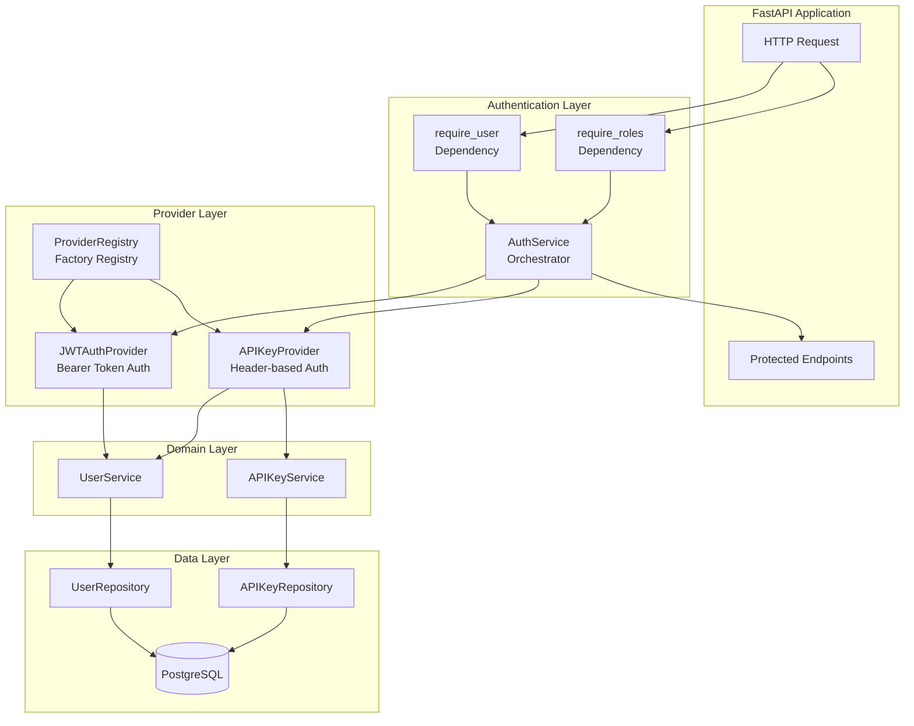
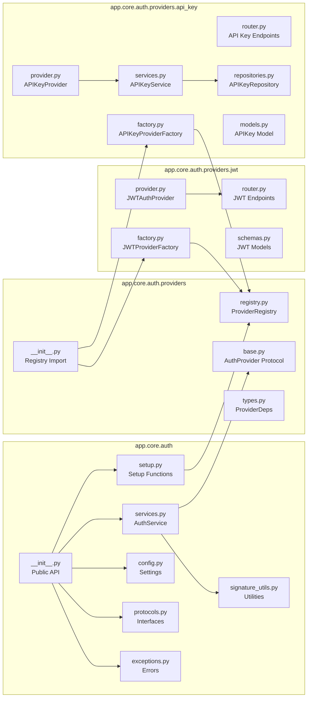
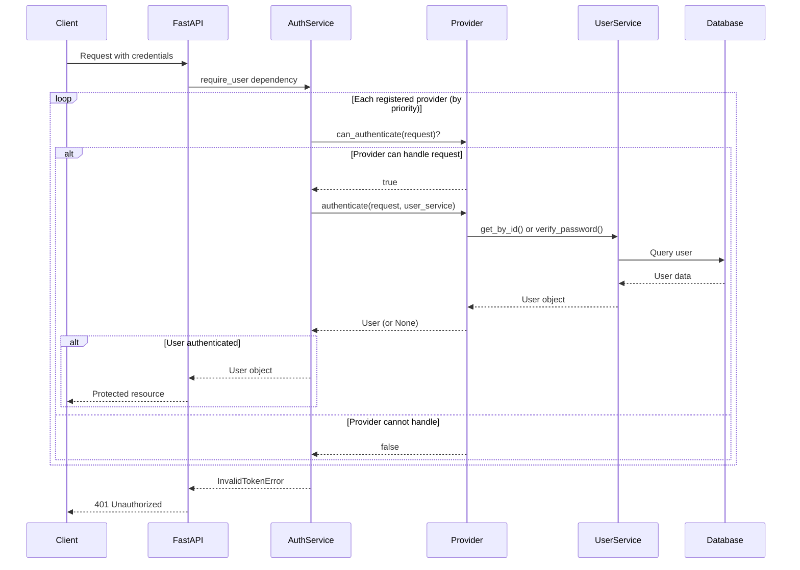
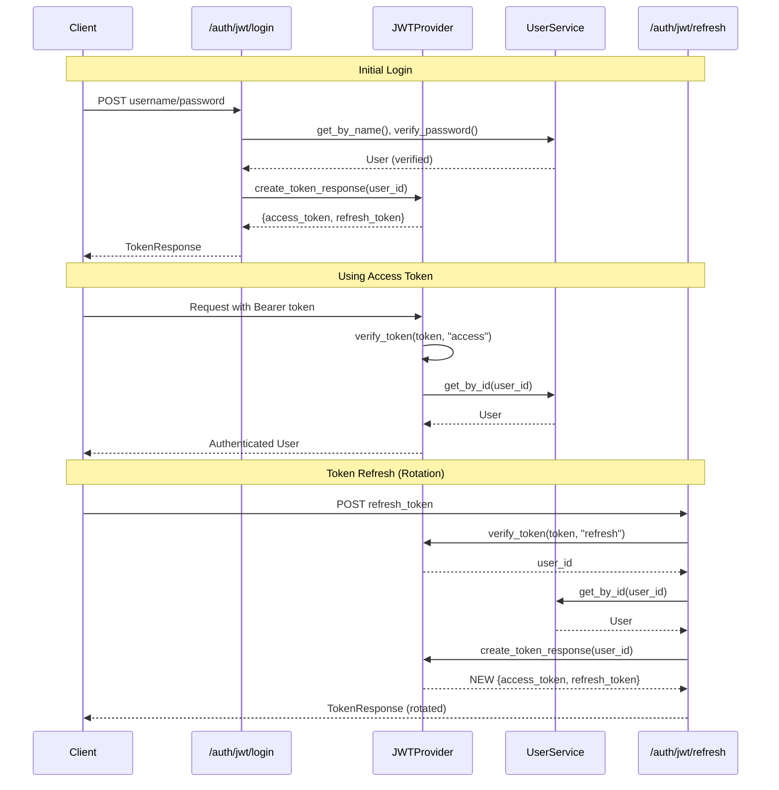
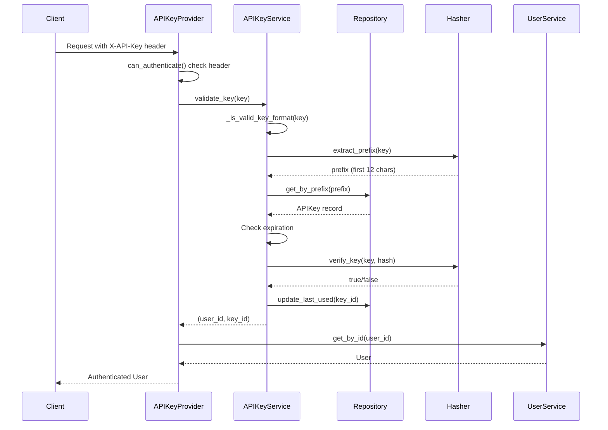
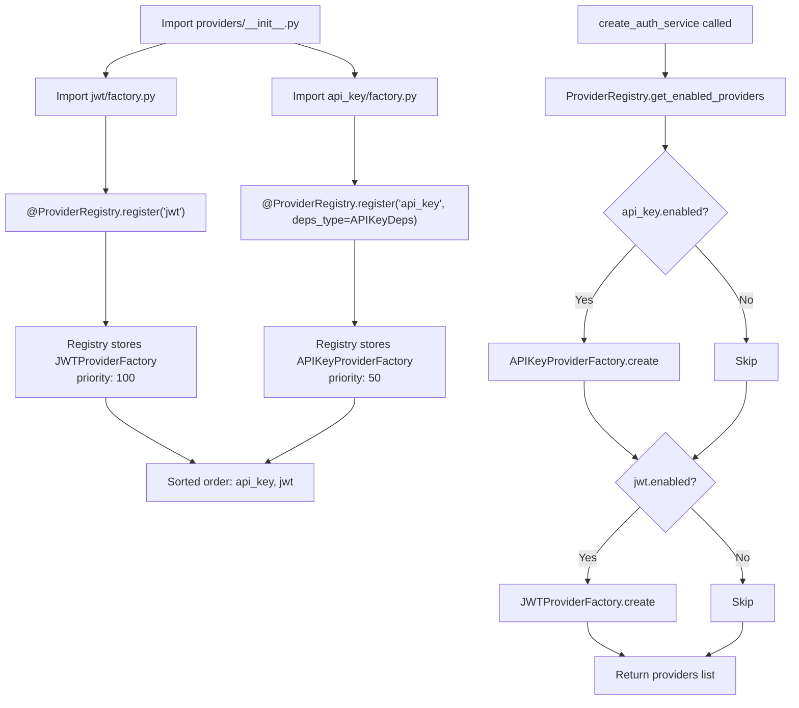

# Authentication System Documentation

## Overview

This module implements a multi-provider authentication system for FastAPI applications. It provides a flexible, extensible architecture supporting multiple authentication mechanisms (JWT, API Key) with role-based access control. The system follows the Strategy and Registry patterns, enabling easy addition of new authentication providers without modifying core code.

## Quick Start

### Basic Authentication Protection

```python
from fastapi import APIRouter, Depends
from app.dependencies import auth_service
from app.domains.users.models import User, UserRole

router = APIRouter()

# Require any authenticated user
@router.get("/protected")
async def protected_route(user: User = Depends(auth_service.require_user)):
    return {"message": f"Hello, {user.username}"}

# Require specific roles
@router.get("/admin-only")
async def admin_route(
    user: User = Depends(auth_service.require_roles(UserRole.ADMIN))
):
    return {"message": "Admin access granted"}
```

### Configuration via Environment Variables

```bash
# Master switch
AUTH__ENABLED=true

# JWT provider (enabled by default)
AUTH__JWT__ENABLED=true
AUTH__JWT__SECRET_KEY=your-32-character-minimum-secret-key
AUTH__JWT__ALGORITHM=HS256
AUTH__JWT__ACCESS_TOKEN_EXPIRE_MINUTES=15
AUTH__JWT__REFRESH_TOKEN_EXPIRE_DAYS=7

# API Key provider (disabled by default)
AUTH__API_KEY__ENABLED=false
AUTH__API_KEY__MAX_PER_USER=5
AUTH__API_KEY__DEFAULT_EXPIRATION_DAYS=30
AUTH__API_KEY__HEADER_NAME=X-API-Key
```

## Architecture

### System Architecture



### Key Components

| Component | Responsibility |
|-----------|----------------|
| `AuthService` | Orchestrates providers, provides FastAPI dependencies (`require_user`, `require_roles`) |
| `ProviderRegistry` | Registers and manages provider factories with priority ordering |
| `AuthProvider` | Protocol defining the provider interface |
| `JWTAuthProvider` | Implements RFC 7519 JWT authentication |
| `APIKeyProvider` | Implements header-based API key authentication |
| `AuthSettings` | Pydantic configuration model with environment variable support |

### Design Patterns

| Pattern | Implementation |
|---------|---------------|
| **Strategy** | `AuthProvider` protocol with multiple implementations |
| **Registry** | `ProviderRegistry` for dynamic provider registration |
| **Factory** | `ProviderFactory` creates provider instances based on settings |
| **Null Object** | `AuthService` with empty providers when auth disabled |
| **Dependency Injection** | FastAPI `Depends()` for per-request service resolution |
| **Protocol/Interface Segregation** | `AuthenticationUserService` minimal interface |

## Dependencies

### External Dependencies

| Package | Purpose |
|---------|---------|
| `fastapi` | Web framework, security schemes, dependency injection |
| `pyjwt` | JWT token encoding/decoding |
| `pydantic` | Configuration and schema validation |
| `structlog` | Structured logging |
| `makefun` | Dynamic function signature generation |
| `sqlmodel` | Database models (for API Key provider) |

### Internal Dependencies



## Code Structure

### Directory Structure

```tree
app/core/auth/
├── __init__.py              # Public API exports
├── config.py                # AuthSettings, JWTSettings, APIKeySettings
├── exceptions.py            # Auth-specific exceptions
├── protocols.py             # AuthenticationUserService protocol
├── services.py              # AuthService orchestrator
├── setup.py                 # create_auth_service, setup_authentication
├── signature_utils.py       # Dynamic signature utilities
└── providers/
    ├── __init__.py          # Imports factories (auto-registration)
    ├── base.py              # AuthProvider protocol
    ├── registry.py          # ProviderRegistry class
    ├── types.py             # ProviderDeps base dataclass
    ├── jwt/
    │   ├── __init__.py      # JWT provider exports
    │   ├── factory.py       # JWTProviderFactory (priority: 100)
    │   ├── provider.py      # JWTAuthProvider implementation
    │   ├── router.py        # /auth/jwt/login, /auth/jwt/refresh
    │   └── schemas.py       # TokenResponse, TokenPayload, RefreshTokenRequest
    └── api_key/
        ├── __init__.py      # API Key provider exports
        ├── dependencies.py  # APIKeyDeps dataclass
        ├── exceptions.py    # API key-specific exceptions
        ├── factory.py       # APIKeyProviderFactory (priority: 50)
        ├── models.py        # APIKey SQLModel
        ├── provider.py      # APIKeyProvider implementation
        ├── repositories.py  # APIKeyRepository
        ├── router.py        # /auth/api-keys/* endpoints
        ├── schemas.py       # APIKeyCreate, APIKeyResponse, etc.
        └── services.py      # APIKeyService business logic
```

### Module Descriptions

| Module | Description |
|--------|-------------|
| `config.py` | Pydantic settings for JWT and API Key configuration with environment variable mapping |
| `exceptions.py` | Domain exceptions: `InvalidTokenError`, `TokenExpiredError`, `InactiveUserError`, `InsufficientPermissionsError` |
| `protocols.py` | `AuthenticationUserService` protocol for minimal user service interface |
| `services.py` | `AuthService` that orchestrates providers and generates FastAPI dependencies |
| `setup.py` | Factory functions for creating and configuring authentication |
| `providers/registry.py` | `ProviderRegistry` with `@register` decorator for provider registration |
| `providers/base.py` | `AuthProvider` protocol defining the provider interface |

## Core Functionality

### Authentication Flow



### JWT Token Flow



### API Key Validation Flow



### Provider Registration



## API Reference

### JWT Endpoints

| Endpoint | Method | Description |
|----------|--------|-------------|
| `/auth/jwt/login` | POST | Authenticate with username/password, returns tokens |
| `/auth/jwt/refresh` | POST | Exchange refresh token for new token pair |

#### Login Request

```python
# OAuth2 password form
username: str
password: str
```

#### Token Response

```python
{
    "access_token": "eyJ...",
    "refresh_token": "eyJ...",
    "token_type": "bearer",
    "expires_in": 900  # seconds
}
```

### API Key Endpoints

| Endpoint | Method | Auth | Description |
|----------|--------|------|-------------|
| `/auth/api-keys` | POST | User | Create new API key |
| `/auth/api-keys` | GET | User | List user's API keys |
| `/auth/api-keys/{key_id}` | DELETE | User | Delete user's own key |
| `/auth/api-keys/users/{user_id}` | GET | Admin | List any user's keys |
| `/auth/api-keys/users/{user_id}/{key_id}` | DELETE | Admin | Delete any user's key |

#### Create API Key Request

```python
{
    "name": "My API Key",
    "expires_in_days": 30  # optional, uses default if not set
}
```

#### Create API Key Response (secret shown only once)

```python
{
    "id": 1,
    "name": "My API Key",
    "key_prefix": "sk_a1b2c3d4",
    "created_at": "2024-01-01T00:00:00Z",
    "expires_at": "2024-01-31T00:00:00Z",
    "last_used_at": null,
    "secret_key": "sk_a1b2c3d4e5f6..."  # Full key, only returned once
}
```

## Configuration

### Environment Variables

| Variable | Type | Default | Description |
|----------|------|---------|-------------|
| `AUTH__ENABLED` | bool | `true` | Master switch for authentication |
| `AUTH__JWT__ENABLED` | bool | `true` | Enable JWT provider |
| `AUTH__JWT__SECRET_KEY` | str | auto-generated | JWT signing secret (min 32 chars) |
| `AUTH__JWT__ALGORITHM` | str | `HS256` | JWT algorithm (HS256/HS384/HS512) |
| `AUTH__JWT__ACCESS_TOKEN_EXPIRE_MINUTES` | int | `15` | Access token lifetime |
| `AUTH__JWT__REFRESH_TOKEN_EXPIRE_DAYS` | int | `7` | Refresh token lifetime |
| `AUTH__API_KEY__ENABLED` | bool | `false` | Enable API Key provider |
| `AUTH__API_KEY__MAX_PER_USER` | int | `5` | Max keys per user |
| `AUTH__API_KEY__DEFAULT_EXPIRATION_DAYS` | int | `30` | Default key expiration |
| `AUTH__API_KEY__HEADER_NAME` | str | `X-API-Key` | Header for API key |

### Settings Classes

```python
from app.core.auth import AuthSettings

# Settings are loaded from environment or use defaults
settings = AuthSettings(
    enabled=True,
    jwt=JWTSettings(
        enabled=True,
        secret_key=SecretStr("your-secret-key"),
        algorithm="HS256",
        access_token_expire_minutes=15,
        refresh_token_expire_days=7,
    ),
    api_key=APIKeySettings(
        enabled=False,
        max_per_user=5,
        default_expiration_days=30,
        header_name="X-API-Key",
    ),
)
```

## Adding a New Authentication Provider

### Step 1: Create Provider Directory

```tree
app/core/auth/providers/oauth2/
├── __init__.py
├── dependencies.py    # If provider needs external dependencies
├── factory.py         # Provider factory with @ProviderRegistry.register
├── provider.py        # AuthProvider implementation
├── router.py          # Provider-specific endpoints
└── schemas.py         # Request/response models
```

### Step 2: Define Dependencies (if needed)

```python
# dependencies.py
from dataclasses import dataclass
from app.core.auth.providers.types import ProviderDeps

@dataclass(frozen=True)
class OAuth2Deps(ProviderDeps):
    """Dependencies required by OAuth2 provider."""
    get_oauth_client: Callable[..., OAuthClient]
```

### Step 3: Implement the Provider

```python
# provider.py
from fastapi import Request
from fastapi.security import OAuth2AuthorizationCodeBearer
from app.core.auth.providers.base import AuthProvider

class OAuth2Provider(AuthProvider):
    name = "oauth2"

    def __init__(self, client_id: str, client_secret: str) -> None:
        self.client_id = client_id
        self.client_secret = client_secret

    def can_authenticate(self, request: Request) -> bool:
        """Check for OAuth2 authorization code or token."""
        return "code" in request.query_params or "Authorization" in request.headers

    async def authenticate(
        self, request: Request, user_service: AuthenticationUserService
    ) -> User | None:
        """Authenticate via OAuth2 flow."""
        # Implementation here
        pass

    def get_security_scheme(self) -> SecurityBase:
        return OAuth2AuthorizationCodeBearer(
            authorizationUrl="/auth/oauth2/authorize",
            tokenUrl="/auth/oauth2/token",
        )

    def get_router(self) -> APIRouter:
        from .router import create_oauth2_router
        return create_oauth2_router(self)
```

### Step 4: Create the Factory

```python
# factory.py
from app.core.auth.providers.registry import ProviderRegistry
from .dependencies import OAuth2Deps

@ProviderRegistry.register("oauth2", deps_type=OAuth2Deps)
class OAuth2ProviderFactory:
    name = "oauth2"
    priority = 75  # Between API Key (50) and JWT (100)
    deps_type = OAuth2Deps

    @staticmethod
    def create(settings: Settings, deps: ProviderDeps | None) -> AuthProvider | None:
        if not settings.auth.oauth2.enabled:
            return None

        if not isinstance(deps, OAuth2Deps):
            raise ValueError("OAuth2 provider requires OAuth2Deps")

        return OAuth2Provider(
            client_id=settings.auth.oauth2.client_id,
            client_secret=settings.auth.oauth2.client_secret,
        )
```

### Step 5: Register via Import

```python
# providers/__init__.py
from app.core.auth.providers.oauth2 import factory as _oauth2_factory  # noqa: F401
```

### Step 6: Provide Dependencies

```python
# app/dependencies.py
if settings.auth.oauth2.enabled:
    provider_deps["oauth2"] = OAuth2Deps(
        get_oauth_client=get_oauth_client,
    )
```

## Security Considerations

### JWT Security

- **Secret Key**: Minimum 32 characters, stored securely (environment variable)
- **Algorithm**: HS256/HS384/HS512 symmetric signing supported
- **Token Rotation**: Refresh tokens issue new access AND refresh tokens
- **Short-lived Access Tokens**: Default 15 minutes to limit exposure
- **Claims Validation**: Required claims (`sub`, `exp`, `iat`, `type`) verified

### API Key Security

- **BCrypt Hashing**: Keys stored as BCrypt hashes, not plaintext
- **Prefix-based Lookup**: Only prefix stored for efficient lookup (safe to log)
- **Key Format**: `sk_` prefix + 64 hex characters (256-bit secret)
- **Rate Limiting**: `max_per_user` prevents key proliferation
- **Expiration**: Keys have configurable expiration dates
- **Last Used Tracking**: Audit trail for key usage

### General Security

- **User Status Check**: Inactive users cannot authenticate
- **Error Messages**: Generic errors prevent user enumeration
- **Structured Logging**: Security events logged with context
- **No Secrets in Logs**: Key prefixes logged, not full keys

## Performance Considerations

### Caching Strategy

- Provider instances created once at startup
- `_dependency_signature` cached via `@cached_property`
- Database sessions created per-request (connection pooling)

### Provider Priority

Providers are tried in priority order (lower = first):

1. **API Key** (50): Checked first, single header lookup
2. **JWT** (100): Checked second, requires token validation

### Best Practices

- Use API keys for server-to-server communication (single lookup)
- Use JWT for user sessions (stateless, no database lookup for validation)
- Enable only required providers to reduce authentication overhead

## Troubleshooting

### Common Issues

| Issue | Cause | Solution |
|-------|-------|----------|
| "No providers configured" | All providers disabled | Enable at least one: `AUTH__JWT__ENABLED=true` |
| "Invalid token" | Wrong secret key | Ensure `AUTH__JWT__SECRET_KEY` matches |
| "API key service not in request state" | Missing dependency | Ensure `APIKeyDeps` registered in `provider_deps` |
| OpenAPI shows single auth | Missing signature generation | Check `_dependency_signature` caching |

### Debug Logging

Enable debug logging for authentication by configuring the log level:

```python
from app.core.logging import configure_logging

# Development: Enable DEBUG level for detailed auth logs
configure_logging(log_level="DEBUG")

# Production: INFO level with file logging
configure_logging(log_level="INFO", log_file_path="logs/app.log")
```

For request-bound logging in authentication handlers:

```python
from app.core.logging import get_request_logger

log = get_request_logger(request, "auth")
log.info("Authentication attempt", user_id=user_id, provider="jwt")
```

For non-request contexts (e.g., startup, background tasks):

```python
import structlog

log = structlog.get_logger("auth.setup")
log.info("Provider initialized", provider="jwt", priority=100)
```

Logger names used by the auth system:

- `auth` - General authentication events
- `auth.setup` - Provider initialization during startup
- `auth.provider.jwt` - JWT provider operations
- `auth.provider.api_key` - API Key provider operations
