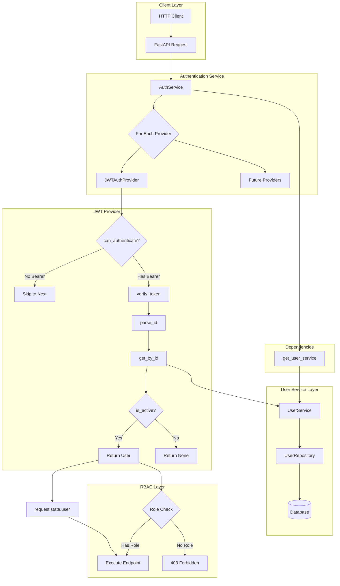
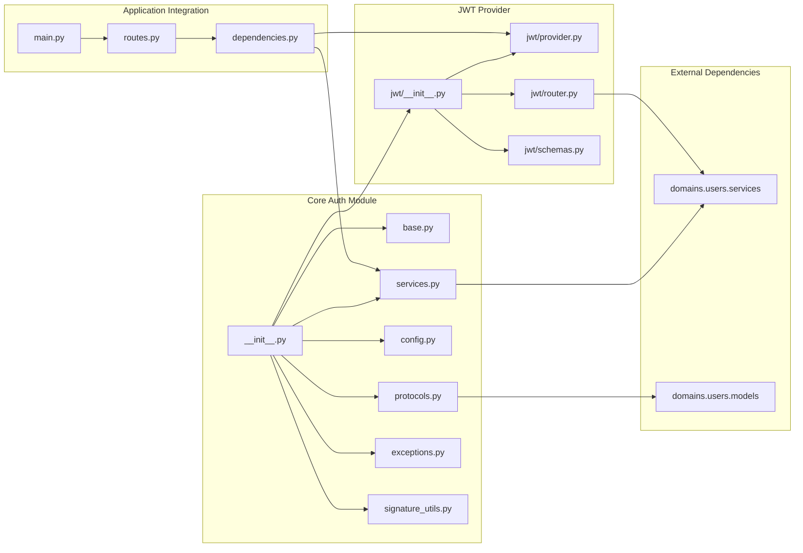
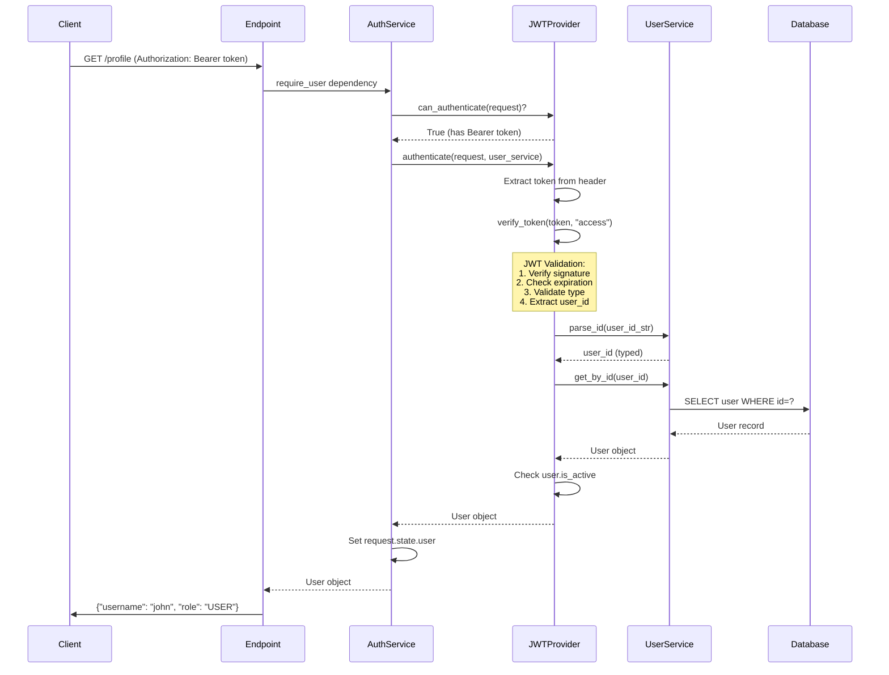
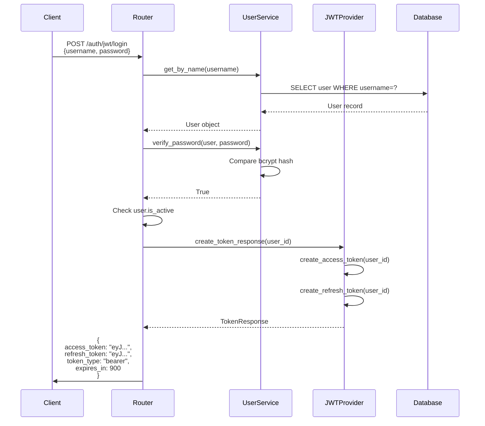
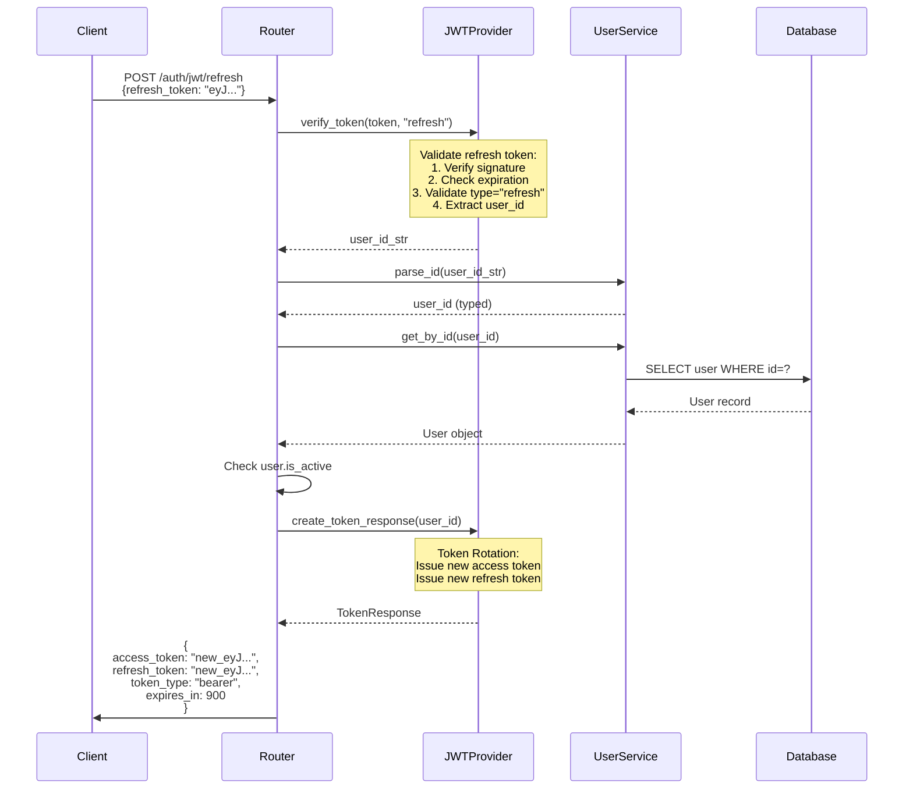
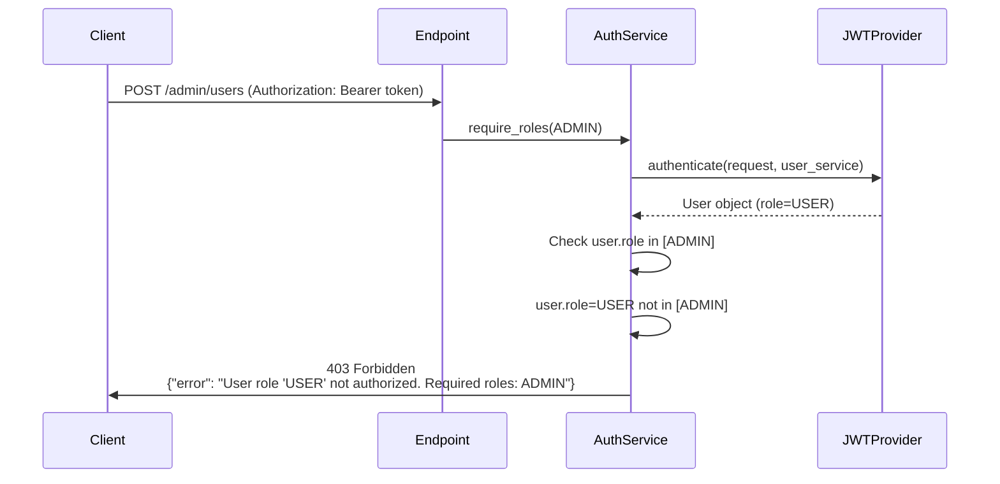
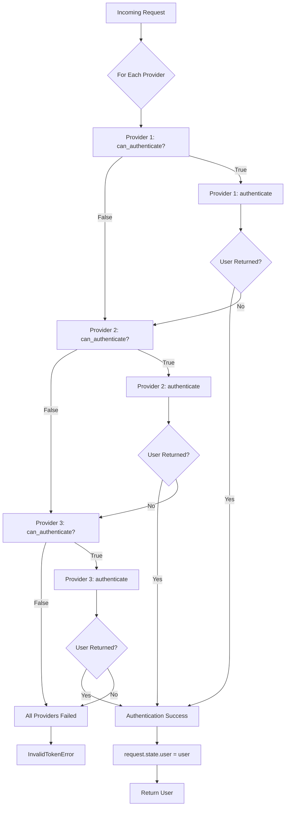
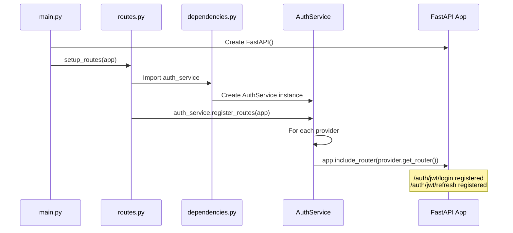

# Authentication System Documentation

## Overview

The authentication system provides a flexible, multi-provider authentication framework for the FastAPI application with RFC 7519-compliant JWT authentication, role-based access control (RBAC), and extensible provider architecture. It's built on Protocol-based abstractions, enabling clean dependency injection and support for multiple authentication mechanisms.

## Quick Start

```python
from fastapi import Depends, FastAPI
from app.dependencies import auth_service
from app.domains.users.models import User, UserRole

app = FastAPI()

# Register authentication routes (login, refresh)
auth_service.register_routes(app)

# Protect endpoint - require any authenticated user
@app.get("/profile")
async def get_profile(user: User = Depends(auth_service.require_user)):
    return {"username": user.username, "role": user.role}

# Protect endpoint - require specific roles
@app.post("/admin/users")
async def create_user(user: User = Depends(auth_service.require_roles(UserRole.ADMIN))):
    return {"message": "Admin access granted"}

# Multiple roles (user must have at least one)
@app.get("/content")
async def get_content(
    user: User = Depends(auth_service.require_roles(UserRole.ADMIN, UserRole.MODERATOR))
):
    return {"message": "Content access"}
```

## Architecture

### System Architecture



### Key Components

- **AuthService**: Orchestrates multiple authentication providers with dependency injection
- **JWTAuthProvider**: RFC 7519-compliant JWT authentication with access/refresh tokens
- **AuthProvider Protocol**: Interface for implementing custom authentication mechanisms
- **AuthenticationUserService Protocol**: Minimal user service interface following ISP
- **RBAC Dependencies**: Role-based access control via FastAPI dependencies
- **Dynamic OpenAPI Integration**: Automatic security scheme registration for all providers

### Design Patterns

1. **Strategy Pattern**: Multiple authentication providers with runtime selection
2. **Protocol Pattern**: Interface segregation via structural typing (no inheritance)
3. **Dependency Injection**: Services injected via FastAPI dependencies
4. **Factory Pattern**: Dynamic router creation per provider
5. **Decorator Pattern**: Dynamic function signatures for OpenAPI documentation
6. **Generic Programming**: Type-safe ID handling (int, UUID) via generics

## Dependencies

### External Dependencies

| Dependency | Purpose |
|------------|---------|
| fastapi | Web framework and dependency injection |
| pyjwt | JWT token encoding and verification |
| structlog | Structured logging |
| pydantic | Data validation and settings management |
| makefun | Dynamic function signature manipulation |

### Internal Dependencies



## Code Structure

```txt
app/core/auth/
├── __init__.py                # Public API exports
├── base.py                    # AuthProvider protocol
├── config.py                  # AuthSettings configuration
├── exceptions.py              # Authentication exceptions
├── protocols.py               # AuthenticationUserService protocol
├── services.py                # AuthService orchestration
├── signature_utils.py         # Dynamic signature utilities
└── providers/                 # Authentication provider implementations
    ├── __init__.py
    ├── base.py               # Provider protocol re-export
    └── jwt/                  # JWT authentication provider
        ├── __init__.py
        ├── provider.py       # JWTAuthProvider implementation
        ├── router.py         # Login and refresh endpoints
        └── schemas.py        # Request/response models
```

## Core Functionality

### Authentication Flow



### Login Flow



### Token Refresh Flow



### Role-Based Access Control Flow



### Multi-Provider Selection



## Configuration

### Environment Variables

Configure JWT authentication via environment variables:

```env
# JWT Configuration
AUTH__JWT__SECRET_KEY=your-secret-key-min-32-characters-long
AUTH__JWT__ALGORITHM=HS256
AUTH__JWT__ACCESS_TOKEN_EXPIRE_MINUTES=15
AUTH__JWT__REFRESH_TOKEN_EXPIRE_DAYS=7

# API Key Configuration
AUTH__API_KEY__MAX_PER_USER=5
AUTH__API_KEY__DEFAULT_EXPIRATION_DAYS=30
AUTH__API_KEY__HEADER_NAME=X-API-Key
```

**Configuration Options:**

| Variable | Default | Description |
|----------|---------|-------------|
| `AUTH__API_KEY__MAX_PER_USER` | 5 | Maximum API keys per user (1-100) |
| `AUTH__API_KEY__DEFAULT_EXPIRATION_DAYS` | 30 | Default key expiration (1-365 days) |
| `AUTH__API_KEY__HEADER_NAME` | X-API-Key | HTTP header name for API key |

**Note:** The configuration uses nested structure. Environment variables use double underscore (`__`) as delimiter (e.g., `AUTH__JWT__SECRET_KEY` → `settings.auth.jwt.secret_key`).

### Security Best Practices

1. **Secret Key**: Use cryptographically secure random key (min 32 characters)
2. **Algorithm**: Use HS256 for symmetric signing (or RS256 for asymmetric)
3. **Token Expiration**: Short-lived access tokens (15 min), longer refresh tokens (7 days)
4. **Token Rotation**: Refresh endpoint issues new tokens (prevents token theft)
5. **HTTPS Only**: Always use HTTPS in production to protect tokens in transit

### Provider Configuration

Configure authentication providers in `dependencies.py`:

```python
from app.core.auth import AuthService, JWTAuthProvider
from app.core.auth.providers.api_key import APIKeyProvider
from app.config import get_settings

settings = get_settings()

# Create JWT provider
jwt_provider = JWTAuthProvider(
    secret_key=settings.auth.jwt.secret_key.get_secret_value(),
    algorithm=settings.auth.jwt.algorithm,
    access_token_expire_minutes=settings.auth.jwt.access_token_expire_minutes,
    refresh_token_expire_days=settings.auth.jwt.refresh_token_expire_days,
)

# Create API Key provider
api_key_provider = APIKeyProvider(
    get_api_key_service=get_api_key_service,  # Required: dependency factory for router
    header_name=settings.auth.api_key.header_name,
)

# Create auth service with providers (order matters - first match wins)
auth_service = AuthService(
    get_user_service=get_user_service,
    providers=[api_key_provider, jwt_provider],  # API key checked first, then JWT
    provider_dependencies={"api_key_service": get_api_key_service},  # For authentication
)
```

**Note:** Providers are tried in order. The first provider where `can_authenticate()` returns `True` handles the request. API keys use header presence, JWT uses Bearer token format.

## Integration Points

### FastAPI Integration

The authentication system integrates with FastAPI through:

1. **Route Registration**: `auth_service.register_routes(app)` in `routes.py`
2. **Dependency Injection**: `Depends(auth_service.require_user)` in endpoints
3. **OpenAPI Documentation**: Automatic security scheme registration
4. **Middleware Stack**: Works with logging middleware for user tracking
5. **Exception Handling**: Auth exceptions handled by global exception handlers

### Application Startup Flow



### Logging Integration

The authentication system integrates with structured logging:

```python
# All authentication events are logged with context
logger.info(
    "user_authenticated",
    provider="jwt",
    user_id=user.id,
    username=user.username,
)

logger.warning(
    "authentication_failed",
    reason="invalid_token",
    provider="jwt",
)
```

### Exception Integration

Authentication exceptions are handled by the global exception system:

- **InvalidTokenError**: 401 Unauthorized
- **TokenExpiredError**: 401 Unauthorized
- **InactiveUserError**: 403 Forbidden
- **InsufficientPermissionsError**: 403 Forbidden

## Development Guidelines

### Using Authentication Dependencies

```python
from fastapi import APIRouter, Depends
from app.dependencies import auth_service
from app.domains.users.models import User, UserRole

router = APIRouter()

# Require any authenticated user
@router.get("/profile")
async def get_profile(user: User = Depends(auth_service.require_user)):
    """Get current user profile."""
    return {"id": user.id, "username": user.username}

# Require specific role
@router.post("/admin/users")
async def create_user(
    user: User = Depends(auth_service.require_roles(UserRole.ADMIN))
):
    """Create new user (admin only)."""
    return {"message": "User created"}

# Require one of multiple roles
@router.delete("/posts/{post_id}")
async def delete_post(
    post_id: int,
    user: User = Depends(auth_service.require_roles(UserRole.ADMIN, UserRole.MODERATOR))
):
    """Delete post (admin or moderator)."""
    return {"message": "Post deleted"}
```

### Adding Custom Authentication Providers

1. **Create provider class** implementing `AuthProvider` protocol:

```python
from app.core.auth.providers.base import AuthProvider
from app.core.auth.protocols import AuthenticationUserService

class APIKeyAuthProvider[ID: (int, UUID)](AuthProvider[ID]):
    """API Key authentication provider."""

    name = "api_key"

    def can_authenticate(self, request: Request) -> bool:
        """Check if request has API key header."""
        return "X-API-Key" in request.headers

    async def authenticate(
        self, request: Request, user_service: AuthenticationUserService[ID]
    ) -> User | None:
        """Authenticate using API key."""
        api_key = request.headers.get("X-API-Key")
        # Implement API key validation
        return user

    def get_security_scheme(self) -> SecurityBase:
        """Return security scheme for OpenAPI."""
        return APIKeyHeader(name="X-API-Key")

    def get_router(self) -> APIRouter:
        """Return provider routes (if any)."""
        return APIRouter()
```

1. **Register provider** in `dependencies.py`:

```python
api_key_provider = APIKeyAuthProvider()

auth_service = AuthService(
    get_user_service=get_user_service,
    providers=[jwt_provider, api_key_provider],  # Order matters!
)
```

1. **Providers are tried in order**: First provider where `can_authenticate()` returns `True` handles the request

### Testing Authentication

```python
import pytest
from httpx import AsyncClient
from app.core.auth.providers.jwt.provider import JWTAuthProvider

@pytest.mark.asyncio
async def test_authenticated_endpoint(
    authenticated_client: AsyncClient,
    integration_settings
):
    """Test endpoint requires authentication."""
    response = await authenticated_client.get(
        f"{integration_settings.API_PATH}/profile"
    )
    assert response.status_code == 200
    data = response.json()
    assert "username" in data

@pytest.mark.asyncio
async def test_admin_only_endpoint(
    admin_client: AsyncClient,
    integration_settings
):
    """Test endpoint requires admin role."""
    response = await admin_client.post(
        f"{integration_settings.API_PATH}/admin/users",
        json={"username": "newuser", "email": "new@example.com"}
    )
    assert response.status_code == 200

@pytest.mark.asyncio
async def test_rejects_non_admin(
    authenticated_client: AsyncClient,
    integration_settings
):
    """Test non-admin cannot access admin endpoints."""
    response = await authenticated_client.post(
        f"{integration_settings.API_PATH}/admin/users",
        json={"username": "newuser", "email": "new@example.com"}
    )
    assert response.status_code == 403
```

### Token Generation for Testing

```python
from app.dependencies import jwt_provider

def test_token_generation():
    """Test JWT token creation and verification."""
    user_id = "123"

    # Create tokens
    access_token = jwt_provider.create_access_token(user_id)
    refresh_token = jwt_provider.create_refresh_token(user_id)

    # Verify tokens
    verified_id = jwt_provider.verify_token(access_token, "access")
    assert verified_id == user_id

    verified_id = jwt_provider.verify_token(refresh_token, "refresh")
    assert verified_id == user_id
```

## API Key Authentication

### Overview

API keys provide a simple authentication mechanism for programmatic access, ideal for:
- Server-to-server communication
- CI/CD pipelines
- Third-party integrations
- Long-running scripts

### API Key Format

Keys follow the format: `sk_` + 64 hex characters (67 characters total)

Example: `sk_a1b2c3d4e5f6789012345678901234567890123456789012345678901234`

### API Key Management Endpoints

**User Operations:**

| Method | Endpoint | Description |
|--------|----------|-------------|
| POST | `/auth/api-keys` | Create a new API key |
| GET | `/auth/api-keys` | List your API keys |
| DELETE | `/auth/api-keys/{key_id}` | Delete an API key |

**Admin Operations:**

| Method | Endpoint | Description |
|--------|----------|-------------|
| GET | `/auth/api-keys/users/{user_id}` | List user's API keys |
| DELETE | `/auth/api-keys/users/{user_id}/{key_id}` | Delete user's API key |

### Usage Examples

**Create an API Key:**

```bash
curl -X POST https://api.example.com/auth/api-keys \
  -H "Authorization: Bearer <jwt_token>" \
  -H "Content-Type: application/json" \
  -d '{"name": "CI Pipeline Key", "expires_in_days": 90}'
```

Response (secret only shown once):
```json
{
  "id": 1,
  "name": "CI Pipeline Key",
  "key_prefix": "sk_a1b2c3d4e5f6",
  "secret_key": "sk_a1b2c3d4e5f6789012345678901234567890123456789012345678901234",
  "is_active": true,
  "created_at": "2024-01-15T10:30:00Z",
  "expires_at": "2024-04-14T10:30:00Z",
  "last_used_at": null
}
```

**Authenticate with API Key:**

```bash
curl https://api.example.com/profile \
  -H "X-API-Key: sk_a1b2c3d4e5f6789012345678901234567890123456789012345678901234"
```

### Security Considerations

1. **Secret Display**: The full API key is only shown once at creation. Store it securely.
2. **Key Rotation**: Create new keys periodically and delete old ones.
3. **Expiration**: Keys have configurable expiration (default: 30 days, max: 365 days).
4. **Per-User Limits**: Users can have up to 5 active keys (configurable).
5. **Timing Attack Protection**: Validation uses constant-time comparison to prevent timing attacks.
6. **BCrypt Hashing**: Keys are stored as bcrypt hashes, never in plaintext.
