# Exception Handling System Documentation

## Overview

The exception handling system provides a comprehensive, type-safe, and security-focused error management framework for the FastAPI application. It ensures consistent error responses, proper logging, and prevents sensitive information leakage while maintaining excellent developer experience.

## Quick Start

```python
from app.core.exceptions import NotFoundError, ValidationError, setup_exception_handlers

# In your FastAPI app initialization
setup_exception_handlers(app)

# In your business logic
def get_user(user_id: int):
    if not user_exists(user_id):
        raise NotFoundError(f"User {user_id} not found")
    return user

# Validation happens automatically through Pydantic schemas
```

## Architecture

### System Architecture


### Key Components

- **Base Exception Classes**: Hierarchical exception system with standardized error codes
- **Exception Handlers**: FastAPI exception handlers for different error types
- **Response Schemas**: Type-safe Pydantic models for consistent error responses
- **Security Layer**: Environment-aware message sanitization and stack trace control
- **Logging Integration**: Structured logging with request tracking and user context

### Design Patterns

1. **Factory Pattern**: Used for creating exception classes with consistent initialization
2. **Strategy Pattern**: Different handlers for different exception types
3. **Template Method**: Consistent error response creation across handlers
4. **Dependency Injection**: ExceptionHandlerService with configurable dependencies

## Dependencies

### External Dependencies

- `fastapi` - Web framework and exception handling integration
- `pydantic` - Data validation and response schema modeling
- `structlog` - Structured logging for error tracking
- `starlette` - Base HTTP exception handling

### Internal Dependencies


## Code Structure

### Directory Structure

```txt
backend/app/core/exceptions/
├── __init__.py          # Public API exports
├── base.py             # Exception hierarchy and error codes
├── handlers.py         # FastAPI exception handlers
└── schemas.py          # Pydantic response models
```

### Module Descriptions

#### `base.py` - Exception Hierarchy

- **ErrorCode**: Enumeration of standardized error codes
- **ApplicationError**: Base exception class with HTTP metadata
- **Specific Exceptions**: Domain-specific exception classes (NotFoundError, ValidationError, etc.)
- **Factory Functions**: Consistent exception class creation

#### `handlers.py` - Exception Processing

- **ExceptionHandlerService**: Service class for error processing and response creation
- **Handler Functions**: FastAPI-compatible async exception handlers
- **Security Functions**: Message sanitization and environment validation
- **Integration**: Request ID tracking and structured logging

#### `schemas.py` - Response Models

- **ErrorDetail**: Basic error information structure
- **ValidationErrorDetail**: Detailed validation error information
- **Response Models**: Specialized response classes for different error types

## Core Functionality

### Exception Hierarchy

```mermaid
classDiagram
    class ApplicationError {
        +str message
        +ErrorCode error_code
        +int status_code
        +dict details
        +dict headers
        +__init__(message, error_code, status_code, details, headers)
    }

    class AuthenticationError {
        +__init__(message?, error_code?, details?, headers?)
    }

    class AuthorizationError {
        +__init__(message?, error_code?, details?, headers?)
    }

    class ValidationError {
        +__init__(message?, error_code?, details?, headers?)
    }

    class NotFoundError {
        +__init__(message?, error_code?, details?, headers?)
    }

    class ConflictError {
        +__init__(message?, error_code?, details?, headers?)
    }

    class BusinessLogicError {
        +__init__(message?, error_code?, details?, headers?)
    }

    class DatabaseError {
        +__init__(message?, error_code?, details?, headers?)
    }

    class ExternalServiceError {
        +__init__(message?, error_code?, details?, headers?)
    }

    ApplicationError <|-- AuthenticationError
    ApplicationError <|-- AuthorizationError
    ApplicationError <|-- ValidationError
    ApplicationError <|-- NotFoundError
    ApplicationError <|-- ConflictError
    ApplicationError <|-- BusinessLogicError
    ApplicationError <|-- DatabaseError
    ApplicationError <|-- ExternalServiceError
```



### Main Error Processing Flow


### Error Code Mapping

| HTTP Status | Error Code | Exception Class | Use Case |
|-------------|------------|-----------------|----------|
| 400 | BUSINESS_RULE_VIOLATION | BusinessLogicError | Business logic violations |
| 401 | AUTHENTICATION_ERROR | AuthenticationError | Authentication failures |
| 403 | AUTHORIZATION_ERROR | AuthorizationError | Permission denied |
| 404 | RESOURCE_NOT_FOUND | NotFoundError | Resource not found |
| 409 | RESOURCE_CONFLICT | ConflictError | Resource conflicts |
| 422 | VALIDATION_ERROR | ValidationError | Input validation failures |
| 500 | DATABASE_ERROR | DatabaseError | Database operation failures |
| 502 | EXTERNAL_SERVICE_ERROR | ExternalServiceError | External API failures |

## Configuration

### Environment Variables

- `ENVIRONMENT`: Controls error message verbosity and stack trace exposure
  - `development`: Detailed error messages with sanitized stack traces
  - `staging`: Reduced error details
  - `production`: Minimal error information for security

### Security Settings

```python
# Message sanitization patterns in handlers.py
SENSITIVE_PATTERNS = [
    r"password[=:][\w\-\.]+",    # password values
    r"token[=:][\w\-\.]+",       # token values
    r"key[=:][\w\-\.]+",         # key values
    r"secret[=:][\w\-\.]+",      # secret values
    r"/[\w\-\./]+",              # file paths
    r"[a-zA-Z]:\\[\\\w\-\.]+",   # Windows paths
]
```

## Integration Points

### FastAPI Integration


### Logging Integration

The exception system integrates with the structured logging system:

```python
# Request context automatically added to logs
log_data = {
    "request_id": request_id,
    "path": str(request.url.path),
    "method": request.method,
    "username": getattr(request.state, "username", None)
}
```

## Development Guidelines

### Exception Usage Patterns

```python
# ✅ Good - Specific exception with context
raise NotFoundError(
    message=f"User with ID {user_id} not found",
    details={"user_id": user_id, "search_context": "active_users"}
)

# ✅ Good - Business logic validation
if user.is_suspended:
    raise BusinessLogicError(
        message="Cannot perform action on suspended user",
        details={"user_status": "suspended", "action": "update_profile"}
    )

# ❌ Bad - Generic exceptions
raise Exception("Something went wrong")

# ❌ Bad - HTTP exceptions in business logic
raise HTTPException(status_code=404, detail="Not found")
```

### Custom Exception Creation

```python
# Add new exception to base.py
_EXCEPTION_CONFIGS["CustomError"] = (
    ErrorCode.CUSTOM_ERROR,
    400,
    "Custom error occurred"
)

class CustomError(ApplicationError):
    """Custom domain-specific exception."""
    __init__ = _create_exception_init(*_EXCEPTION_CONFIGS["CustomError"])
```

### Testing Approach

```python
import pytest
from app.core.exceptions import NotFoundError, ErrorCode

def test_not_found_error_creation():
    """Test NotFoundError with custom message and details."""
    error = NotFoundError(
        message="User not found",
        details={"user_id": 123}
    )

    assert error.message == "User not found"
    assert error.error_code == ErrorCode.RESOURCE_NOT_FOUND
    assert error.status_code == 404
    assert error.details == {"user_id": 123}

async def test_exception_handler_response(client):
    """Test exception handler creates proper response."""
    # Test implementation would make request that triggers exception
    # and verify response format
```

## Security Considerations

### Information Disclosure Prevention

1. **Environment-Based Error Details**: Production environments return minimal error information
2. **Message Sanitization**: Automatic removal of sensitive patterns from error messages
3. **Stack Trace Control**: Stack traces only included in development mode
4. **Request ID Tracking**: Secure request correlation without exposing internal details

### Security Features

- **Credential Pattern Detection**: Automatically redacts passwords, tokens, and keys
- **Path Sanitization**: Removes file system paths from error messages
- **Depth-Limited Serialization**: Prevents infinite recursion in error details
- **Production Hardening**: Validates secure configuration in production environments

## Performance Considerations

### Optimization Techniques

1. **Type Dispatch Pattern**: Fast exception type resolution using lookup tables
2. **Factory Pattern**: Eliminates code duplication in exception classes
3. **Lazy Evaluation**: Request IDs generated only when needed
4. **Efficient JSON Serialization**: Custom serializers for complex data types

### Caching Strategies

- Exception handler functions are registered once at startup
- Error code mappings use static dictionaries for O(1) lookup
- Message sanitization patterns compiled once at module load
