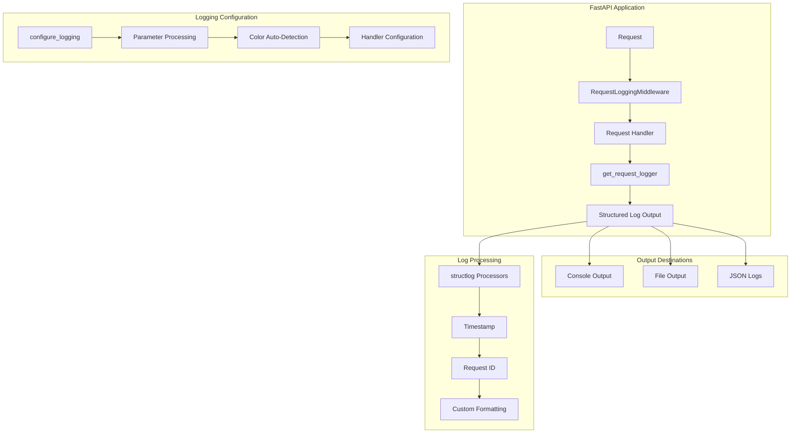
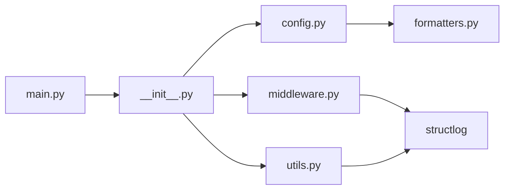
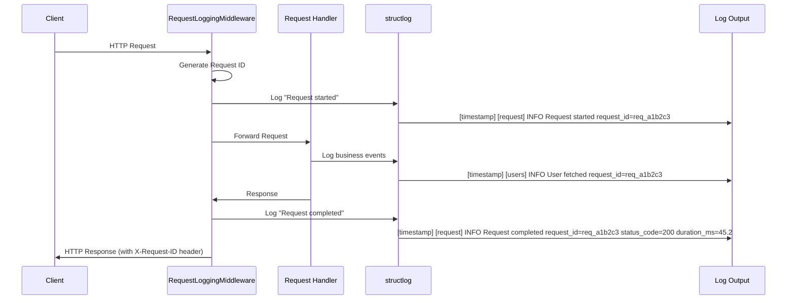
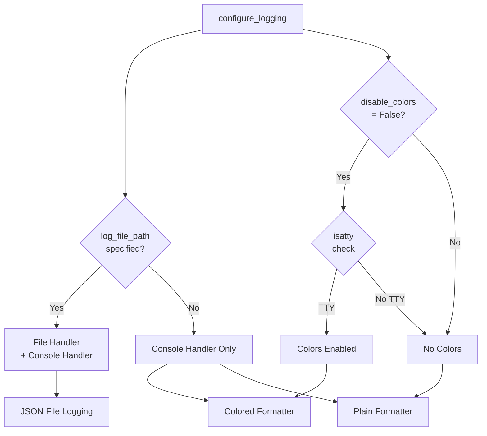

# Logging System Documentation

## Overview

The logging system provides comprehensive structured logging for the FastAPI application with request tracking, flexible parameter-based configuration, and consistent formatting. It's built on top of `structlog` for structured logging and integrates seamlessly with FastAPI middleware for automatic request/response logging.

## Quick Start

```python
from app.core.logging import configure_logging, RequestLoggingMiddleware, get_request_logger

# Configure logging (typically in main.py)
# Development: DEBUG level with auto-detected colors
configure_logging(log_level="DEBUG")

# Production: INFO level with file logging
configure_logging(log_level="INFO", log_file_path="logs/app.log")

# Add middleware to FastAPI app
app.add_middleware(RequestLoggingMiddleware)

# Use in endpoints
@app.get("/users/{user_id}")
async def get_user(user_id: int, request: Request):
    log = get_request_logger(request, "users")
    log.info("Fetching user", user_id=user_id)
    return {"user_id": user_id}
```

## Architecture

### System Architecture



### Key Components

- **RequestLoggingMiddleware**: Automatic request/response logging with unique request IDs and wildcard route exclusion
- **configure_logging**: Simple parameter-based logging setup with auto-detection and flexible configuration
- **Custom Formatters**: Ordered console output with consistent column layout and optional colors
- **Utility Functions**: Helper functions for request-bound logging

### Design Patterns

- **Middleware Pattern**: Request logging implemented as FastAPI middleware
- **Factory Pattern**: Environment-specific logger configuration
- **Decorator Pattern**: structlog processors for log enhancement
- **Strategy Pattern**: Different formatters for different environments

## Dependencies

### External Dependencies

| Dependency | Version | Purpose |
|------------|---------|---------|
| structlog | >=25.4.0 | Structured logging framework |
| fastapi | >=0.115.12 | Web framework (for middleware) |
| uvicorn | (implicit) | ASGI server (logs are silenced) |

### Internal Dependencies



## Code Structure

### Directory Structure

```structure
app/core/logging/
├── __init__.py           # Public API exports
├── config.py            # Environment-aware configuration
├── constants.py         # Logging constants and configuration
├── formatters.py        # Custom log formatters
├── middleware.py        # FastAPI request logging middleware
└── utils.py             # Helper functions
```

### Module Descriptions

#### `__init__.py`

Main package interface exposing the public API:

- `configure_logging`: Main configuration function
- `RequestLoggingMiddleware`: Request tracking middleware
- `get_request_id`, `get_request_logger`: Utility functions

#### `config.py`

Parameter-based logging configuration:

- Direct control via `log_level`, `log_file_path`, and `disable_colors` parameters
- Auto-detects color support using `isatty()` for optimal terminal output
- Conditionally enables file logging when `log_file_path` is specified
- Silences noisy third-party loggers (uvicorn, httpx, httpcore, asyncio, multipart, watchfiles.main)
- Sets up structured logging with consistent processors

#### `constants.py`

Centralized configuration constants for the logging system:

- **Request ID Configuration**: `REQUEST_ID_LENGTH = 12`, `REQUEST_ID_PREFIX = "req_"`
- **File Logging Configuration**: `MAX_LOG_FILE_SIZE = 10MB`, `LOG_FILE_BACKUP_COUNT = 5`
- **Formatter Configuration**: `DEFAULT_EVENT_WIDTH = 30`
- **Common Excluded Routes**: Predefined list of routes to exclude from request logging (`/health`, `/ping`, `/metrics`, `/docs`, `/openapi.json`, `/redoc`, `/favicon.ico`)

#### `formatters.py`

Custom formatting for consistent log output:

- Ordered console renderer with fixed column layout
- Consistent format: `timestamp, logger, level, message, additional_fields`
- Support for colored and plain text output

#### `middleware.py`

FastAPI middleware for request tracking:

- Generates unique request IDs for each request (format: `req_` + 6-character hex)
- Logs request start/completion/failure with timing
- Includes session context when available (extracted from `request.state.session`)
- Configurable route exclusion with exact paths and wildcard patterns (defaults to `LoggingConstants.COMMON_EXCLUDED_ROUTES`)
- Configurable logger name (default: "request")

#### `utils.py`

Helper functions for application logging:

- `get_request_id`: Extract request ID from FastAPI request
- `get_request_logger`: Create request-bound logger instance

## Core Functionality

### Request Logging Flow



### Configuration Flow



### Log Format Structure

All logs follow a consistent format with ordered columns:

1. **Timestamp** (ISO format, UTC)
2. **Logger Name** (in brackets)
3. **Level** (colored/styled)
4. **Message** (main event description)
5. **Additional Fields** (key=value pairs)

Example output:

```logs
2024-01-15T10:30:45.123456Z [request] INFO Request started request_id=req_a1b2c3 method=GET path=/users/123
2024-01-15T10:30:45.145678Z [users] INFO User fetched request_id=req_a1b2c3 user_id=123 operation=fetch
2024-01-15T10:30:45.167890Z [request] INFO Request completed request_id=req_a1b2c3 status_code=200 duration_ms=45.2
```

## Configuration

### Direct Parameters

The `configure_logging()` function accepts the following parameters:

- **`log_level`** (str, default: "INFO"): Log level (DEBUG, INFO, WARNING, ERROR, CRITICAL)
- **`log_file_path`** (str | None, default: None): Path to log file. If specified, enables JSON file logging with rotation. If None, only console logging is used.
- **`disable_colors`** (bool, default: False): If True, disables colored output. If False, colors are auto-detected using `isatty()`

### Environment Variables

You can configure logging via environment variables in your `.env` file:

```env
LOG__LEVEL=DEBUG                    # Set log level (note: double underscore for nested config)
LOG__FILE_PATH=logs/app.log        # Enable file logging
LOG__DISABLE_COLORS=false          # Auto-detect colors (default)
```

**Note:** The configuration uses nested structure. Environment variables use double underscore (`__`) as delimiter (e.g., `LOG__LEVEL` → `settings.LOG.LEVEL`).

### Middleware Configuration

```python
app.add_middleware(
    RequestLoggingMiddleware,
    excluded_routes=[                         # Skip logging for these routes (defaults to LoggingConstants.COMMON_EXCLUDED_ROUTES)
        "/health",                           # Exact path matching
        "/metrics",                          # Exact path matching
        "*/health",                          # Wildcard: matches /api/health, /v1/health, etc.
        "/api/*",                            # Wildcard: matches /api/users, /api/posts, etc.
        "/api/*/metrics",                    # Complex pattern: matches /api/v1/metrics, /api/v2/metrics
    ],
    logger_name="request",                    # Logger name for middleware (default: "request")
)
```

#### Route Exclusion Patterns

The middleware supports both exact path matching and wildcard patterns:

**Exact Paths:**

- `/health` - matches only `/health`
- `/ping` - matches only `/ping`

**Wildcard Patterns:**

- `*/health` - matches any path ending with `/health` (e.g., `/api/health`, `/v1/health`)
- `/api/*` - matches any path starting with `/api/` (e.g., `/api/users`, `/api/posts/123`)
- `/api/*/health` - matches paths with specific structure (e.g., `/api/v1/health`, `/api/admin/health`)
- `/v?/health` - matches single character wildcards (e.g., `/v1/health`, `/v2/health`)
- `/v[12]/health` - matches character sets (e.g., `/v1/health`, `/v2/health` but not `/v3/health`)

**Performance Notes:**

- Exact paths use O(1) set lookup for maximum performance
- Wildcard patterns are only checked if exact match fails
- Patterns are processed in order until first match

### File Logging (Production)

- **Location**: `logs/app.log`
- **Format**: JSON structured logs
- **Rotation**: 10MB max size (LoggingConstants.MAX_LOG_FILE_SIZE), 5 backup files (LoggingConstants.LOG_FILE_BACKUP_COUNT)
- **Level**: INFO and above

## Integration Points

### FastAPI Integration

The logging system integrates with FastAPI through:

1. **Application Startup**: `configure_logging()` called in `main.py` lifespan with settings from environment
2. **Middleware Stack**: `RequestLoggingMiddleware` added to app
3. **Request Handlers**: Using `get_request_logger()` in endpoints
4. **Session Integration**: Automatic username logging when session middleware provides it

Example from `main.py`:

```python
from app.config import get_settings
from app.core.logging import configure_logging

settings = get_settings()

@asynccontextmanager
async def lifespan(_app: FastAPI) -> AsyncGenerator[None, None]:
    configure_logging(
        log_level=settings.LOG.LEVEL,
        log_file_path=settings.LOG.FILE_PATH,
        disable_colors=settings.LOG.DISABLE_COLORS,
    )
    yield
```

### External Service Integration

The system is designed to work with:

- **Monitoring Systems**: Structured JSON logs for log aggregation
- **Error Tracking**: Consistent error formatting with request IDs
- **Performance Monitoring**: Request timing and duration tracking

## Development Guidelines

### Creating Loggers

```python
# In request handlers
log = get_request_logger(request, "module_name")
log = log.bind(user_id=user_id, operation="specific_action")

# For background tasks or non-request contexts
import structlog
log = structlog.get_logger("background_tasks")
```

### Logging Best Practices

1. **Use Structured Logging**: Add context as key-value pairs
2. **Include Request IDs**: Always use `get_request_logger()` in request handlers
3. **Bind Context Early**: Add relevant context to logger instances
4. **Avoid String Formatting**: Use structlog's key-value approach
5. **Log at Appropriate Levels**: DEBUG for development, INFO for operations, WARN/ERROR for issues

### Testing Approach

```python
def test_logging_middleware(app, client):
    # Configure with WARNING level and no colors for tests
    configure_logging(log_level="WARNING", disable_colors=True)
    response = client.get("/test")
    assert "X-Request-ID" in response.headers
    assert response.status_code == 200

def test_with_file_logging(tmp_path):
    # Test file logging
    log_file = tmp_path / "test.log"
    configure_logging(log_level="INFO", log_file_path=str(log_file))
    # ... test code ...
    assert log_file.exists()
```

## Security Considerations

- **Request ID Generation**: Uses cryptographically secure random hex tokens (format: `req_` + 6-character hex, total length 12 characters)
- **Log Sanitization**: Structured logging prevents injection attacks
- **Sensitive Data**: No automatic PII logging (usernames only when explicitly provided)
- **File Permissions**: Log files created with appropriate permissions

## Performance Considerations

- **Caching**: structlog loggers are cached on first use
- **Async-Safe**: All logging operations are async-safe
- **Route Exclusion**: Health checks and metrics endpoints excluded from logging
- **Log Rotation**: Automatic file rotation prevents disk space issues

## Usage Examples

### Configuration Examples

```python
# Example 1: Development - DEBUG level with auto-detected colors
configure_logging(log_level="DEBUG")

# Example 2: Production - INFO level with file logging, no colors
configure_logging(
    log_level="INFO",
    log_file_path="logs/app.log",
    disable_colors=True
)

# Example 3: Staging - INFO level with file logging, auto-detected colors
configure_logging(
    log_level="INFO",
    log_file_path="logs/staging.log"
)

# Example 4: CI/Testing - WARNING level, no colors
configure_logging(
    log_level="WARNING",
    disable_colors=True
)

# Example 5: Custom log file location
configure_logging(
    log_level="INFO",
    log_file_path="/var/log/myapp/application.log"
)
```

### Basic Request Logging

```python
@app.get("/users/{user_id}")
async def get_user(user_id: int, request: Request):
    log = get_request_logger(request, "users")
    log.info("Fetching user", user_id=user_id)

    # Business logic here
    user = await user_service.get_user(user_id)

    log.info("User fetched successfully", user_id=user_id, email=user.email)
    return user
```

### Error Logging

```python
@app.post("/users")
async def create_user(user_data: UserCreate, request: Request):
    log = get_request_logger(request, "users")
    log.info("Creating user", email=user_data.email)

    try:
        user = await user_service.create_user(user_data)
        log.info("User created successfully", user_id=user.id, email=user.email)
        return user
    except ValidationError as e:
        log.error("User creation failed", error=str(e), email=user_data.email)
        raise HTTPException(status_code=400, detail=str(e))
```

### Background Task Logging

```python
@celery_app.task
def process_data(data_id: int):
    log = structlog.get_logger("background_tasks")
    log = log.bind(task="process_data", data_id=data_id)

    log.info("Processing data started")
    # Processing logic here
    log.info("Processing data completed")
```

### Wildcard Route Exclusion Examples

```python
from app.core.logging import RequestLoggingMiddleware

# Example 1: Exclude all health endpoints across API versions
app.add_middleware(
    RequestLoggingMiddleware,
    excluded_routes=["*/health", "*/ping", "*/metrics"]
)

# Example 2: Exclude specific API versions
app.add_middleware(
    RequestLoggingMiddleware,
    excluded_routes=["/api/v1/*", "/api/v2/*", "/admin/*"]
)

# Example 3: Complex patterns for structured APIs
app.add_middleware(
    RequestLoggingMiddleware,
    excluded_routes=[
        "/health",              # Exact match
        "/api/*/health",        # Version-specific health endpoints
        "/api/*/metrics",       # Version-specific metrics
        "/admin/*/monitoring",  # Admin monitoring endpoints
        "/docs",                # API documentation
        "*.json",              # All JSON files
    ]
)
```
