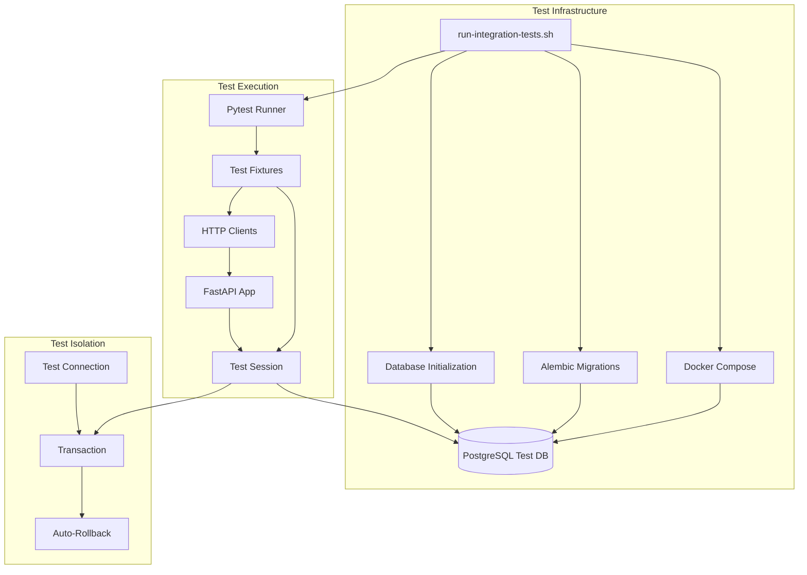
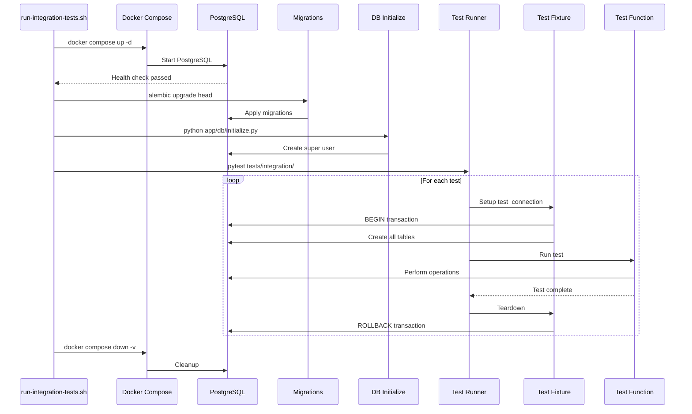
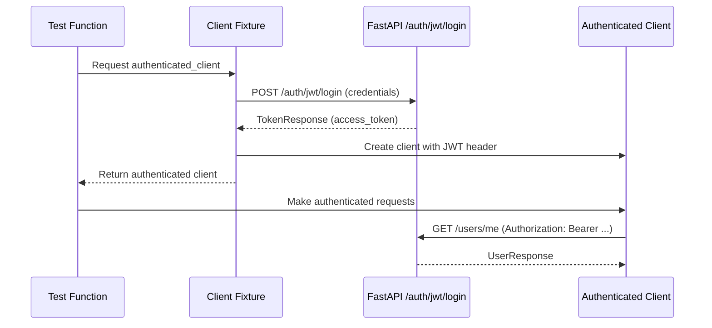
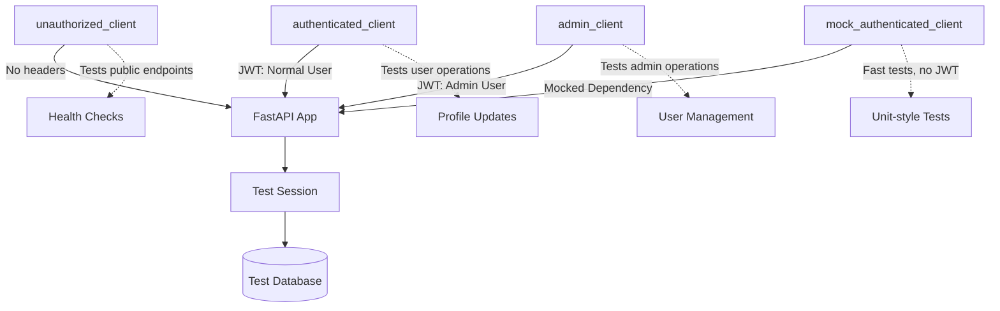
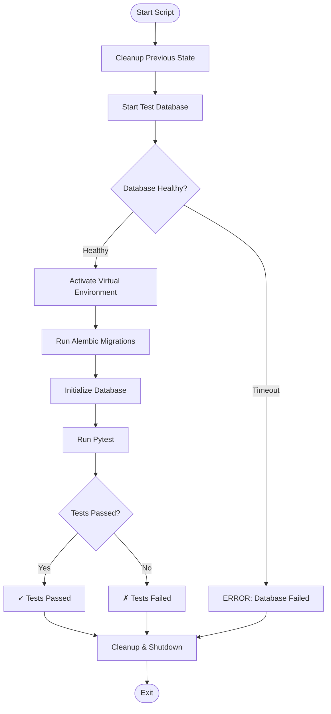

# Integration Tests Documentation

## Overview

The integration test suite validates the complete FastAPI application stack, including database interactions, authentication flows, authorization rules, and API endpoint behavior. Tests run against a real PostgreSQL database using Docker Compose, ensuring high confidence in production-like scenarios.

## Quick Start

```bash
# Run all integration tests with test database setup
./scripts/run-integration-tests.sh

# Run specific test file
./scripts/run-integration-tests.sh tests/integration/domains/users/test_endpoints.py

# Run tests matching pattern
./scripts/run-integration-tests.sh -k "test_creates_user"

# Run with verbose output
./scripts/run-integration-tests.sh -v
```

## Architecture

### System Architecture



### Key Components

- **Test Infrastructure**: Docker-based PostgreSQL database with health checks
- **Database Isolation**: Transactional test sessions with automatic rollback
- **Client Fixtures**: Pre-configured HTTP clients for different authentication scenarios
- **User Fixtures**: Test users (normal and admin) for authorization testing
- **Session Management**: AsyncSession with NullPool for test independence

### Design Patterns

1. **Fixture Pattern**: Reusable test data and infrastructure via pytest fixtures
2. **Dependency Injection**: FastAPI dependency overrides for test isolation
3. **Factory Pattern**: User creation via services for realistic test scenarios
4. **Transaction Per Test**: Each test runs in isolated transaction with rollback
5. **Client Strategy**: Different clients for different authentication states

## Code Structure

### Directory Structure

```txt
tests/integration/
├── __init__.py                 # IntegrationSettings configuration
├── conftest.py                # Shared fixtures and test infrastructure
├── README.md                  # This documentation
└── domains/                   # Domain-specific integration tests
    ├── __init__.py
    ├── health/
    │   ├── __init__.py
    │   └── test_endpoints.py  # Health check endpoint tests
    └── users/
        ├── __init__.py
        ├── test_endpoints.py  # User API endpoint tests
        └── test_repository.py # User repository integration tests
```

### Module Descriptions

#### `__init__.py` - Test Settings

Provides `IntegrationSettings` class with test-specific configuration:

- **Database Settings**: localhost:5432 with test credentials
- **Logging Settings**: WARNING level with no colors for clean test output
- Inherits from main `Settings` for consistent configuration structure

#### `conftest.py` - Test Infrastructure

Central fixture provider with multiple layers:

**Database Fixtures:**

- `integration_settings`: Test-specific settings instance
- `test_engine`: AsyncEngine with NullPool for isolation
- `test_connection`: Transactional connection with automatic rollback
- `test_session`: AsyncSession bound to test connection
- `override_get_session`: Dependency override for FastAPI

**User Data Fixtures:**

- `normal_user_data`: Normal user creation data (USER role)
- `admin_user_data`: Admin user creation data (ADMIN role)
- `ensure_test_users`: Creates/retrieves both test users
- `normal_user_credentials`: Credentials for normal user login
- `admin_user_credentials`: Credentials for admin user login

**HTTP Client Fixtures:**

- `unauthorized_client`: No authentication headers
- `authenticated_client`: JWT-authenticated normal user
- `admin_client`: JWT-authenticated admin user
- `mock_authenticated_client`: Mocked authentication (fast, no JWT)

## Core Functionality

### Test Isolation Flow



### Database Transaction Isolation

Each test runs in an isolated transaction:

1. **Connection Creation**: `test_connection` fixture creates connection and begins transaction
2. **Schema Creation**: All SQLModel tables created in transaction
3. **Test Execution**: Test performs database operations
4. **Automatic Rollback**: Transaction rolled back after test completes
5. **Clean State**: Next test starts with fresh transaction

This ensures:

- **Test Independence**: Tests don't affect each other
- **Fast Execution**: No database cleanup needed between tests
- **Predictable State**: Each test starts with known database state

### Authentication Flow



### Client Fixture Strategy



## Configuration

### Environment Variables

The test script sets these environment variables:

```bash
# Database Configuration
POSTGRES__HOST=localhost
POSTGRES__PORT=5432
POSTGRES__USER=test_user
POSTGRES__PASSWORD=test_password
POSTGRES__DB=test_db

# Logging Configuration
LOG__LEVEL=WARNING
LOG__DISABLE_COLORS=true

# JWT Authentication Configuration
AUTH__JWT__SECRET_KEY=test-secret-key-min-32-chars-long-for-security
AUTH__JWT__ALGORITHM=HS256
AUTH__JWT__ACCESS_TOKEN_EXPIRE_MINUTES=15
AUTH__JWT__REFRESH_TOKEN_EXPIRE_DAYS=7

# Super User Configuration
SUPER_USER__NAME=testadmin
SUPER_USER__EMAIL=testadmin@example.com
SUPER_USER__PASSWORD=testpass123
```

### Docker Compose Configuration

Test database configuration (`docker-compose.test.yml`):

- **Image**: PostgreSQL 15
- **Port**: 5432 (exposed to host)
- **Health Check**: `pg_isready` every 5 seconds
- **Temporary Storage**: Uses tmpfs for faster I/O
- **Auto-cleanup**: Volumes destroyed after tests

### Pytest Configuration

Integration tests use these markers and settings:

- **`@pytest.mark.asyncio`**: Required for all async test functions
- **`@pytest.mark.parametrize`**: For testing multiple scenarios
- **Session Scope**: Some fixtures use session scope for performance
- **Function Scope**: Most fixtures use function scope for isolation

## Integration Points

### FastAPI Integration

Tests integrate with FastAPI through:

1. **ASGI Transport**: Direct app invocation via `httpx.ASGITransport(app=app)`
2. **Dependency Overrides**: `app.dependency_overrides[get_session] = test_session`
3. **Middleware Stack**: Full middleware execution including logging, CORS, exceptions
4. **Request Lifecycle**: Complete request/response cycle with validation

### Database Integration

Integration with database layer:

1. **Migration Application**: Alembic migrations run before tests
2. **Schema Creation**: SQLModel tables created per test transaction
3. **Repository Testing**: Direct repository method testing with real database
4. **Relationship Testing**: Foreign key and relationship validation

### Authentication Integration

JWT authentication integration:

1. **Token Generation**: Real JWT tokens via `/auth/jwt/login` endpoint
2. **Token Validation**: FastAPI validates JWT on protected routes
3. **Role-Based Access**: Tests verify ADMIN vs USER authorization
4. **Session State**: Request state properly populated with user context

## Development Guidelines

### Writing Integration Tests

#### Test Naming Convention

```python
# For endpoint tests
def test_[action]_[resource]_[condition]() -> None:
    """Test [description]."""

# Examples:
def test_creates_user_as_admin() -> None:
    """Test admin successfully creates new user."""

def test_raises_forbidden_when_non_admin_lists_users() -> None:
    """Test non-admin user cannot list users."""
```

#### Test Structure Template

```python
"""Integration tests for [domain] [component]."""

import httpx
import pytest
from tests.integration import IntegrationSettings


class Test[ComponentName]:
    """Test suite for [component] endpoints/functionality."""

    @pytest.mark.asyncio
    async def test_[action]_successfully(
        self,
        authenticated_client: httpx.AsyncClient,
        integration_settings: IntegrationSettings,
    ) -> None:
        """Test successful [action]."""
        response = await authenticated_client.post(
            f"{integration_settings.API_PATH}/endpoint",
            json={"data": "value"},
        )

        assert response.status_code == 200
        data = response.json()
        assert data["field"] == "expected_value"
```

#### Using Parametrization

```python
@pytest.mark.asyncio
@pytest.mark.parametrize(
    ("input_value", "expected_status"),
    [
        ("valid_value", 200),
        ("invalid_value", 422),
        ("", 422),
    ],
    ids=["valid", "invalid", "empty"],
)
async def test_validates_input(
    self,
    admin_client: httpx.AsyncClient,
    integration_settings: IntegrationSettings,
    input_value: str,
    expected_status: int,
) -> None:
    """Test input validation for various values."""
    response = await admin_client.post(
        f"{integration_settings.API_PATH}/endpoint",
        json={"field": input_value},
    )
    assert response.status_code == expected_status
```

### Client Selection Guide

| Scenario | Client Fixture | Use Case |
|----------|---------------|----------|
| Public endpoints | `unauthorized_client` | Health checks, public APIs |
| User operations | `authenticated_client` | Profile updates, user actions |
| Admin operations | `admin_client` | User management, admin features |
| Fast unit-style tests | `mock_authenticated_client` | Bypass JWT for speed |

### Adding New Domain Tests

1. **Create domain directory**: `tests/integration/domains/{domain_name}/`
2. **Add `__init__.py`**: Empty file for package structure
3. **Create test files**:
   - `test_endpoints.py` - API endpoint integration tests
   - `test_repository.py` - Repository method integration tests (if applicable)
   - `test_services.py` - Service layer integration tests (if applicable)
4. **Use existing fixtures**: Reuse database, client, and user fixtures
5. **Follow test naming**: Use consistent naming conventions
6. **Test all scenarios**: Happy path, errors, authorization, validation

### Testing Best Practices

1. **Test Independence**: Never rely on test execution order
2. **Use Transactions**: Rely on automatic rollback for cleanup
3. **Verify Response Schema**: Use Pydantic models to validate responses
4. **Test Authorization**: Verify both authorized and forbidden scenarios
5. **Test Validation**: Cover edge cases and invalid inputs
6. **Avoid Sleeps**: Use synchronous fixtures and proper waits
7. **Descriptive Assertions**: Make assertion failures clear

## Test Execution

### Script Workflow

The `run-integration-tests.sh` script executes these steps:


